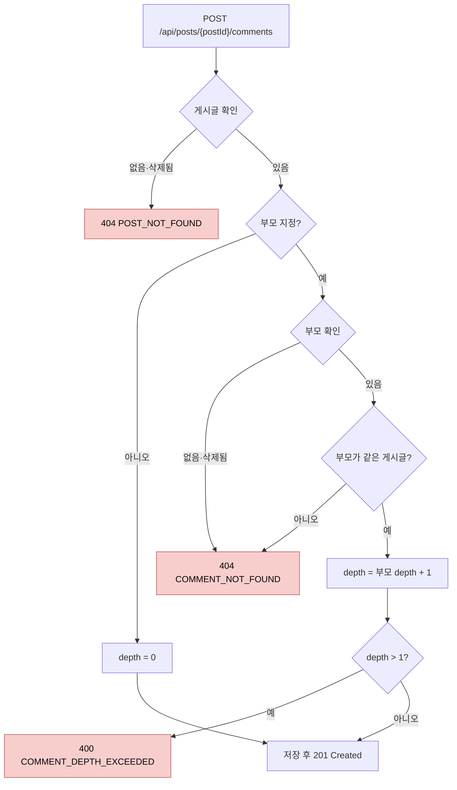

# 댓글 설계 명세서

> [프로젝트 SDS](../../project/sds.md)의 아키텍처와 공통 컴포넌트를 전제로 한다. 이 문서는 `com.board.bbs.comment` 패키지와 화면의 `features/comment`만 다룬다.
>
> **이 문서가 다루지 않는 것:** 메서드 시그니처(코드가 기준), 요청·응답 필드(OpenAPI 문서가 기준), 테스트 목록([QA 체크리스트](qa-checklist.md)가 기준). 작성 기준은 [문서 체계 §8](../../README.md#8-sds-작성-기준)에 있다.

## 1. 설계 개요

댓글은 게시글과 **별개의 애그리게이트**다. 게시글 하나에 댓글이 수백 개 달릴 수 있으므로, 댓글을 게시글 애그리게이트 안에 두면 댓글 하나를 쓸 때마다 게시글 전체를 불러오고 잠가야 한다. 그래서 댓글은 게시글을 **식별자로만 참조**한다.

댓글 기능은 게시글 기능에 다음 두 경로로만 연결된다 ([ADR-0009](../../project/adr/0009-feature-boundaries-via-events.md)).

| 경로 | 방향 | 용도 |
|---|---|---|
| `post`의 `PostQueryService` 호출 | comment → post | 작성과 목록 조회 전에 게시글이 있고 삭제되지 않았는지 확인 |
| `PostDeleted` 이벤트 수신 | post → comment (런타임) | 게시글이 삭제되면 그 댓글을 일괄 삭제 |

## 2. 구성 요소

### 2.1 도메인 (`comment.domain`)

| 요소 | 종류 | 책임 |
|---|---|---|
| `Comment` | 애그리게이트 루트 | 본문 보유. 생성할 때 부모가 같은 게시글인지 검사하고 깊이를 정한다. 수정·삭제 권한과 삭제 상태를 검사한다 |
| `CommentBody` | 값 객체 | 본문 규칙 ([SRS §2](srs.md#2-데이터-항목)) |
| `CommentId` | 값 객체 | 댓글 식별자 |

**부모와 깊이 규칙은 생성 시점에 결정된다.** 도메인이 부모 댓글 자체를 받아 검사하므로, 서비스를 거치지 않는 경로가 생겨도 규칙이 지켜진다.

| 상황 | 결과 |
|---|---|
| 부모 없음 | 원댓글, 깊이 0 |
| 부모가 다른 게시글의 댓글 | `COMMENT_NOT_FOUND`. 다른 게시글의 댓글은 이 게시글에서 보이지 않으므로 없는 댓글과 같게 취급한다 |
| 부모가 원댓글 | 대댓글, 깊이 1 |
| 부모가 대댓글 | `COMMENT_DEPTH_EXCEEDED` |

수정은 작성자만, 삭제는 작성자 또는 관리자만 할 수 있다. 삭제된 댓글은 수정·삭제할 수 없다 (`COMMENT_NOT_FOUND`).

### 2.2 애플리케이션 (`comment.application`)

인바운드 포트는 두지 않는다 ([ADR-0010](../../project/adr/0010-drop-inbound-ports.md)).

| 요소 | 종류 | 책임 |
|---|---|---|
| `CommentCommandService` | 서비스 | 작성, 수정, 삭제, 게시글 단위 일괄 삭제 |
| `CommentQueryService` | 서비스 | 게시글별 목록을 원댓글 단위 묶음으로 조회. 게시글이 없으면 `POST_NOT_FOUND` |
| `CommentThread` | 조회 모델 | 목록의 한 항목. 원댓글 하나와 그 살아 있는 대댓글을 묶는다. 원댓글은 삭제된 상태일 수 있다 |
| `CommentRepository` | 아웃바운드 포트 | 댓글 저장·조회, 목록에 나올 원댓글의 페이지와 그 대댓글 조회(작성 순), 게시글 단위 일괄 소프트 삭제 |

### 2.3 어댑터 (`comment.adapter`)

| 요소 | 위치 | 책임 |
|---|---|---|
| `CommentController` | `in/web` | REST 엔드포인트. 관리자 여부를 정해 서비스에 넘긴다 |
| 응답 DTO | `in/web/dto` | 삭제된 댓글의 본문과 작성자를 가린다. 노출 규칙을 웹 어댑터 한 곳에 둔다 |
| `PostDeletedListener` | `in/event` | `PostDeleted`를 동기로 받아 일괄 삭제를 요청한다 |
| `CommentPersistenceAdapter` | `out/persistence` | `CommentRepository` 구현 |

## 3. 처리 흐름

### 3.1 작성 (CMT-FR-001, 002, 003, 008)

하나의 트랜잭션에서 다음 순서로 검사한다.

게시글 확인은 게시글 행에 공유 잠금(`FOR SHARE`)을 걸면서 한다. 게시글 삭제는 그 시점에 있는 댓글만 함께 지우므로, 확인과 저장 사이에 삭제가 커밋되면 새 댓글이 삭제된 게시글에 살아남는다. 공유 잠금은 삭제와 충돌하므로 어느 쪽이 먼저든 안전하다.

- 작성이 먼저 잠그면 삭제는 작성이 커밋될 때까지 기다린다. 그 뒤의 일괄 삭제가 새 댓글까지 지운다.
- 삭제가 먼저 갱신하면 작성은 삭제가 커밋될 때까지 기다린 뒤 게시글을 다시 판정하고 `404 POST_NOT_FOUND`로 끝난다.

공유 잠금끼리는 충돌하지 않으므로 같은 게시글에 동시에 댓글을 다는 요청은 서로 기다리지 않는다. 대신 게시글 행을 갱신하는 요청(조회수·좋아요 수 증가, 게시글 수정)은 댓글 작성 트랜잭션이 끝날 때까지 기다린다. 작성 트랜잭션은 짧으므로 이 지연을 받아들인다.

"게시글 확인"은 `post` 기능의 서비스가, "부모 확인"은 저장소가, 같은 게시글 검사와 깊이 계산은 도메인(`Comment`)이 맡는다.

### 3.2 게시글 삭제에 따른 일괄 삭제 (CMT-FR-007)

1. `post` 기능이 게시글을 삭제하고 `PostDeleted`를 발행한다.
2. `PostDeletedListener`가 **같은 트랜잭션에서 동기로** 받아, 그 게시글의 삭제되지 않은 댓글을 게시글 삭제 시각으로 한꺼번에 소프트 삭제한다.
3. 게시글 삭제가 롤백되면 댓글 삭제도 함께 롤백된다.

일괄 UPDATE는 영속성 컨텍스트를 우회하므로 반영 전 변경을 먼저 flush해야 한다 ([코딩 표준 CS-B33](../../project/coding-standards.md#34-영속성)). 그렇지 않으면 같은 트랜잭션에서 앞서 기록한 게시글의 삭제 시각이 유실된다.

### 3.3 목록 (CMT-FR-004, 009)

읽기 전용 트랜잭션 하나에서 다음 순서로 처리한다.

1. 게시글이 있고 삭제되지 않았는지 확인한다. 아니면 `404 POST_NOT_FOUND`.
2. 목록에 나올 원댓글을 한 페이지 읽는다. 삭제되지 않은 원댓글과, 삭제되었지만 살아 있는 대댓글이 있는 원댓글이 대상이다. 정렬은 작성 순(같으면 식별자 순)으로 고정하고, 요청의 정렬 파라미터는 무시한다.
3. 원댓글이 있으면 그 원댓글들의 살아 있는 대댓글을 한 번에 읽어 원댓글별로 묶는다.
4. 대댓글이 하나도 없는 삭제된 원댓글은 뺀다. 2와 3은 다른 쿼리라서 그 사이에 마지막 대댓글이 삭제될 수 있기 때문이다.

원댓글 페이지와 대댓글을 쿼리 두 번으로 나눠 읽으므로, 대댓글 수와 상관없이 페이지 크기는 원댓글 수로 정해진다.

## 4. 인터페이스 설계

엔드포인트 목록은 [SRS §5](srs.md#5-인터페이스)에, 요청·응답 필드는 OpenAPI 문서에 있다. 필드 목록만으로는 드러나지 않는 의미는 다음과 같다.

- 목록의 각 항목은 원댓글과 그 대댓글의 묶음이다. 페이지 크기와 전체 건수는 원댓글 수 기준이다.
- 삭제된 원댓글은 삭제 여부로 표시하고 본문과 작성자를 담지 않는다. 살아 있는 대댓글이 있을 때만 나온다.
- 정렬은 고정이며 요청의 정렬 파라미터는 무시한다.
- 응답에 작성자 닉네임이 없다 ([SRS CMT-OPEN-04](srs.md#6-미결-사항)).
- 부모 댓글이 없거나, 삭제되었거나, 다른 게시글의 댓글이면 모두 같은 `COMMENT_NOT_FOUND`다.
- 댓글 기능이 쓰는 오류 코드는 `INVALID_REQUEST`, `UNAUTHENTICATED`, `ACCESS_DENIED`, `POST_NOT_FOUND`, `COMMENT_NOT_FOUND`, `COMMENT_DEPTH_EXCEEDED`다 ([프로젝트 SRS §5.1](../../project/srs.md#51-오류-코드-목록)).

## 5. 데이터 설계

[프로젝트 SDS §5](../../project/sds.md#5-데이터-관점)의 `comment` 테이블을 사용한다. 이 기능에 고유한 데이터 설계는 다음과 같다.

- 깊이는 저장한다. 도메인 규칙과 별도로 데이터베이스의 `CHECK` 제약이 0과 1만 허용한다.
- 부모는 같은 테이블을 가리키는 외래 키다. 같은 게시글인지는 데이터베이스가 아니라 도메인이 검사한다.
- 목록 조회용 부분 인덱스가 두 개 있다. 원댓글 인덱스(게시글, 작성 시각, 식별자 / 깊이 0)는 삭제된 원댓글도 포함해야 하므로 삭제 여부 조건이 없다. 대댓글 인덱스(부모, 작성 시각, 식별자 / 삭제되지 않은 댓글)는 대댓글 조회와 "살아 있는 대댓글이 있는가" 검사가 함께 쓴다. 기존의 삭제되지 않은 댓글 인덱스는 게시글 단위 일괄 삭제가 쓴다.

## 6. 화면 설계 (`services/web/src/app/features/comment`)

[코딩 표준 CS-F01](../../project/coding-standards.md#5-프론트엔드-규칙)의 구조를 따른다.

| 요소 | 책임 |
|---|---|
| 스토어 (`comment.store.ts`) | 게시글별 댓글 목록을 보유하고, 작성·수정·삭제 후 다시 불러온다 |
| 댓글 영역 | 목록과 입력란을 배치한다. 묶음마다 원댓글을 그리고 그 아래에 대댓글을 그린다. 제목의 댓글 수는 화면에 보이는 댓글(삭제되지 않은 원댓글과 대댓글)을 센다 |
| 댓글 항목 | 깊이 1이면 들여 쓴다. 원댓글에만 답글 버튼, 작성자에게만 수정·삭제를 보여 준다. 삭제된 댓글은 "삭제된 댓글입니다"만 표시하고 버튼을 그리지 않는다 |
| 입력 폼 | 등록에 성공하면 입력란을 비운다 |

서버가 원댓글 단위로 묶어서 주므로 화면은 묶음 구조를 그대로 그린다.

## 7. 설계 결정

| 결정 | 이유 | 대안과 기각 이유 |
|---|---|---|
| 댓글을 별도 애그리게이트로 두고 게시글을 식별자로 참조 | 댓글 작성이 게시글을 갱신하거나 전체를 불러오지 않는다 | 게시글 애그리게이트에 포함: 댓글 수에 비례해 비용 증가 |
| 깊이를 저장하고 생성 시점에 결정 | 목록 조회 시 재귀 없이 깊이를 알 수 있다 | 매번 부모를 따라 계산: 조회 비용 증가 |
| 같은 게시글 검사를 도메인에서 함 | 서비스를 우회하는 경로가 생겨도 규칙이 지켜진다 | 서비스에서 검사: [ADR-0003](../../project/adr/0003-authorization-in-domain.md)과 같은 이유로 기각 |
| 다른 게시글의 부모를 `COMMENT_NOT_FOUND`로 거부 | 다른 게시글의 댓글 존재 여부를 노출하지 않는다 | `INVALID_REQUEST`: 존재를 암시한다. 새 오류 코드: 클라이언트가 구분할 필요가 없다 |
| 게시글 삭제 시 이벤트로 일괄 소프트 삭제 | 기능 사이의 순환 제거, 같은 트랜잭션 보장 | [ADR-0009](../../project/adr/0009-feature-boundaries-via-events.md) |
| 목록을 원댓글 단위 묶음으로 반환하고 원댓글 수로 페이지를 나눔 (1.4.0) | 한 대화가 페이지 경계에서 갈라지지 않고, 화면이 묶음을 다시 만들 필요가 없다 | 평면 목록을 묶음 순서로 정렬: 변경은 작지만 대댓글이 다음 페이지로 넘어갈 수 있다. 1.3.0까지는 평면 목록이었다 |
| 원댓글 페이지와 대댓글을 쿼리 두 번으로 조회 | 쿼리가 단순하고 각각 인덱스를 쓴다 | 윈도 함수로 한 번에 조회: 쿼리가 복잡하다. 재귀 쿼리: 깊이가 1로 고정이라 과하다 |
| 작성 시 게시글 행을 공유 잠금으로 확인 (1.5.0) | 삭제와 동시에 작성해도 삭제된 게시글에 살아 있는 댓글이 남지 않는다. 같은 게시글의 다른 작성과는 충돌하지 않는다. 대가로 같은 게시글의 카운터 증가와 수정이 작성 트랜잭션 동안 기다린다 | 배타 잠금: 같은 게시글의 댓글 작성이 서로 기다린다. 삭제 후 정리 작업: 그 사이에 살아 있는 댓글이 보인다. 직렬화 격리 수준: 재시도 처리가 필요하다 |
| 두 쿼리 사이의 불일치는 결과에서 걸러 냄 | 대댓글 없는 삭제된 원댓글이 나가지 않게 하는 가장 작은 변경이다 | 반복 읽기 격리 수준으로 한 스냅숏 사용: 데이터베이스 격리 수준 설정에 기대게 된다 |
| 삭제된 댓글의 본문·작성자는 응답 변환에서 가림 | 도메인 모델은 그대로 두고 노출 규칙만 웹 어댑터에 둔다. 응답에 본문이 남지 않는다 | 화면에서만 숨김: API 응답으로 삭제된 본문이 노출된다 |

## 8. 요구사항 대응표

요구사항을 어떤 설계 요소가 맡는지 보여 준다. 검증하는 테스트는 [QA 체크리스트](qa-checklist.md)에 있다.

| 요구사항 | 설계 요소 |
|---|---|
| CMT-FR-001 | `CommentCommandService`, `post`의 `PostQueryService`, `CommentBody` (§3.1) |
| CMT-FR-002, 003, 008 | `Comment` (부모와 깊이 규칙, §2.1), 깊이 `CHECK` 제약 |
| CMT-FR-004 | `CommentQueryService`, `CommentThread`, `CommentRepository` (§3.3), 목록 조회용 인덱스 (§5) |
| CMT-FR-009 | `CommentRepository`의 원댓글 조회 조건, `CommentQueryService`의 불일치 제거 (§3.3), 응답 DTO의 가림 (§2.3) |
| CMT-FR-005, 006 | `Comment` (수정·삭제 규칙) |
| CMT-FR-007 | `PostDeletedListener`, `CommentRepository`의 일괄 삭제 (§3.2) |
| CMT-FR-020~023 | `features/comment` 화면 요소 (§6) |

## 변경 이력

| 버전 | 일자 | 변경 내용 | 작성자 |
|---|---|---|---|
| 1.0.0 | 2026-10-09 | 최초 작성 (`main` e96a878 기준으로 역작성) | HseongH |
| 1.1.0 | 2026-10-09 | 인바운드 포트 제거와 저장소 포트 통합 반영 (ADR-0010). 작성 흐름을 Mermaid 다이어그램으로 교체 | HseongH |
| 1.2.0 | 2026-10-09 | `Comment.write`가 부모 댓글을 받아 같은 게시글인지 검사하도록 변경(CMT-FR-008). 목록 조회가 게시글 존재를 확인 | HseongH |
| 1.3.0 | 2026-10-09 | 세밀도 조정: 메서드 시그니처, 응답 필드 예시, SQL 원문, 테스트 목록을 빼고 책임·흐름·결정 중심으로 재작성. 목록 흐름에 게시글 확인 단계 반영, 오류 코드 선택 근거를 설계 결정에 추가 | HseongH |
| 1.4.0 | 2026-10-09 | 목록을 원댓글 단위 묶음으로 변경(CMT-FR-004)하고 삭제된 원댓글 자리 표시 추가(CMT-FR-009). 조회 흐름, 조회 모델, 응답의 가림, 인덱스, 화면, 설계 결정 갱신 | HseongH |
| 1.5.0 | 2026-10-09 | 작성: 게시글 확인을 공유 잠금으로 바꿔 게시글 삭제와의 경쟁을 막음 (CMT-SRS 1.3.0) | HseongH |
| 1.5.1 | 2026-10-09 | 화면 설계 절의 경로를 `services/web/`으로 정정 (모노레포 전환, ADR-0014). 의미 변경 없음 | HseongH |
