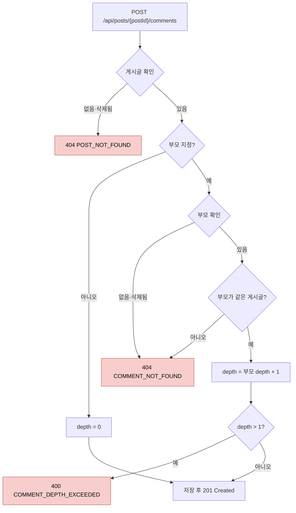

# 댓글 설계 명세서

> [프로젝트 SDS](../../project/sds.md)의 아키텍처와 공통 컴포넌트를 전제로 한다. 이 문서는 `com.board.bbs.comment` 패키지와 화면의 `features/comment`만 다룬다.

## 1. 설계 개요

댓글은 게시글과 **별개의 애그리게이트**다. 게시글 하나에 댓글이 수백 개 달릴 수 있으므로, 댓글을 게시글 애그리게이트 안에 두면 댓글 하나를 쓸 때마다 게시글 전체를 불러오고 잠가야 한다. 그래서 `Comment`는 `PostId`로 게시글을 **식별자로만 참조**한다.

댓글 기능은 게시글 기능에 다음 두 경로로만 연결된다 ([ADR-0009](../../project/adr/0009-feature-boundaries-via-events.md)).

- 작성 시 게시글 존재 확인: `post`의 애플리케이션 서비스 `PostQueryService.getById` 호출
- 게시글 삭제 시 댓글 정리: 도메인 이벤트 `PostDeleted` 수신

## 2. 구성 요소

### 2.1 도메인 (`comment.domain`)

| 요소 | 종류 | 책임 |
|---|---|---|
| `Comment` | 애그리게이트 루트 | 본문 보유, 부모와 같은 게시글인지 검사, 깊이 결정과 제한, 수정·삭제 권한과 삭제 상태 검사 |
| `CommentId` | 값 객체 | 1 이상의 식별자 |
| `CommentBody` | 값 객체 | 공백 제거 후 1~1,000자 |

부모 규칙과 깊이 규칙은 생성 시점에 결정된다.

```
Comment.write(postId, author, body, parent)
  parent == null → depth = 0
  parent.postId != postId → BusinessException(COMMENT_NOT_FOUND)
  depth = parent.depth + 1
  depth > MAX_DEPTH(1) → BusinessException(COMMENT_DEPTH_EXCEEDED)
```

다른 게시글의 댓글은 이 게시글에서 보이지 않으므로, 없는 댓글과 같은 오류로 거부한다.

| 메서드 | 사전 조건 | 실패 |
|---|---|---|
| `updateBy(requester, body)` | 삭제되지 않음, `requester == authorId` | 삭제됨 → `COMMENT_NOT_FOUND`, 작성자 아님 → `ACCESS_DENIED` |
| `deleteBy(requester, admin, now)` | 삭제되지 않음, `admin` 또는 `requester == authorId` | 위와 같음 |

### 2.2 애플리케이션 (`comment.application`)

**애플리케이션 서비스**

인바운드 포트는 두지 않는다 ([ADR-0010](../../project/adr/0010-drop-inbound-ports.md)).

| 서비스 | 메서드 | 호출하는 곳 |
|---|---|---|
| `CommentCommandService` | `write(postId, author, body, parentCommentId?) → CommentId` | `CommentController` |
| | `update(id, requester, body)` | `CommentController` |
| | `delete(id, requester, admin)` | `CommentController` |
| | `deleteAllOfPost(postId, deletedAt)` | `PostDeletedListener` |
| `CommentQueryService` | `list(postId, pageable) → Page<Comment>` | `CommentController` |

**아웃바운드 포트**

| 포트 | 메서드 | 어댑터 |
|---|---|---|
| `CommentRepository` | `save`, `load`(삭제되지 않은 댓글, 없으면 `COMMENT_NOT_FOUND`), `listByPost`(작성 순), `softDeleteAllByPost`(일괄 소프트 삭제) | `CommentPersistenceAdapter` |

**다른 기능에 대한 의존**

| 대상 | 용도 |
|---|---|
| `post.application.service.PostQueryService` | `getById`로 작성 전 게시글이 존재하고 삭제되지 않았는지 확인 |
| `post.domain.PostId`, `post.domain.PostDeleted` | 게시글 식별자, 삭제 이벤트 |
| `member.domain.MemberId` | 작성자 식별자 |

### 2.3 어댑터 (`comment.adapter`)

| 요소 | 위치 | 책임 |
|---|---|---|
| `CommentController` | `in/web` | REST 엔드포인트, 관리자 여부 판단 |
| `WriteCommentRequest`, `UpdateCommentRequest` | `in/web/dto` | 입력 검증 |
| `CommentResponse` | `in/web/dto` | 응답 직렬화 |
| `PostDeletedListener` | `in/event` | `PostDeleted` 수신 → `CommentCommandService.deleteAllOfPost` 호출 |
| `CommentJpaEntity`, `CommentJpaRepository`, `CommentMapper` | `out/persistence` | 매핑, 조회, 일괄 소프트 삭제 |

## 3. 처리 흐름

### 3.1 작성 (CMT-FR-001, 002, 003)

`CommentCommandService.write`는 하나의 트랜잭션에서 다음 순서로 검사한다.



| 단계 | 담당 코드 |
|---|---|
| 게시글 확인 | `PostQueryService.getById(postId)` (post 기능의 서비스) |
| 부모 확인 | `CommentRepository.load(parentId)` |
| 같은 게시글 검사, depth 계산과 제한 | `Comment.write(...)` (도메인) |
| 저장 | `CommentRepository.save(comment)` |

### 3.2 게시글 삭제에 따른 일괄 삭제 (CMT-FR-007)

```
[post] PostCommandService.delete → publishEvent(PostDeleted(postId, deletedAt))
  └─ [comment] PostDeletedListener.on(event)                  동기 @EventListener, 같은 트랜잭션
       └─ CommentCommandService.deleteAllOfPost(postId, deletedAt)
            └─ CommentRepository.softDeleteAllByPost(postId, deletedAt)
            └─ UPDATE comment SET deleted_at = :deletedAt
               WHERE post_id = :postId AND deleted_at IS NULL
```

일괄 UPDATE는 영속성 컨텍스트를 우회하므로 `@Modifying(flushAutomatically = true, clearAutomatically = true)`로 선언한다. flush 없이 clear하면 같은 트랜잭션에서 앞서 변경한 내용(게시글의 `deleted_at`)이 유실된다.

### 3.3 목록 (CMT-FR-004)

```sql
SELECT * FROM comment
WHERE post_id = ? AND deleted_at IS NULL
ORDER BY created_at ASC, id ASC
OFFSET ? LIMIT ?
```

부분 인덱스 `idx_comment_active_by_post (post_id, created_at, id) WHERE deleted_at IS NULL`이 조건과 정렬을 모두 지원한다.

## 4. 인터페이스 설계

```jsonc
// POST /api/posts/{postId}/comments
{ "body": "댓글 본문", "parentCommentId": 12 }   // parentCommentId는 선택

// PATCH /api/comments/{id}
{ "body": "수정한 본문" }

// GET /api/posts/{postId}/comments → PageResponse<CommentResponse>
{ "content": [
    { "id": 12, "postId": 1, "authorId": 7, "body": "원댓글", "parentCommentId": null, "depth": 0, "createdAt": "..." },
    { "id": 13, "postId": 1, "authorId": 8, "body": "답글",   "parentCommentId": 12,   "depth": 1, "createdAt": "..." } ],
  "page": 0, "size": 20, "totalElements": 2, "totalPages": 1, "last": true }
```

| 상황 | 상태 | code |
|---|---|---|
| 본문 규칙 위반 | 400 | `INVALID_REQUEST` (+ `errors.body`) |
| 대댓글에 답글 | 400 | `COMMENT_DEPTH_EXCEEDED` |
| 미인증 | 401 | `UNAUTHENTICATED` |
| 작성자 아님 | 403 | `ACCESS_DENIED` |
| 게시글 없음·삭제됨 | 404 | `POST_NOT_FOUND` |
| 댓글(또는 부모 댓글) 없음·삭제됨 | 404 | `COMMENT_NOT_FOUND` |

## 5. 데이터 설계

[프로젝트 SDS §5](../../project/sds.md#5-데이터-관점)의 `comment` 테이블을 사용한다 (`V3__create_comment.sql`). 깊이는 도메인 규칙과 별도로 `ck_comment_depth CHECK (depth BETWEEN 0 AND 1)`로 한 번 더 막는다.

## 6. 화면 설계 (`frontend/src/app/features/comment`)

| 요소 | 책임 |
|---|---|
| `comment-api.service.ts` | HTTP 호출 |
| `comment.store.ts` | 게시글별 댓글 목록 보유, 작성·수정·삭제 후 재조회 |
| `components/comment-section` | 목록과 입력란 배치 |
| `components/comment-item` | 댓글 하나. 깊이 1이면 들여쓰기. 원댓글에만 답글 버튼, 작성자에게만 수정·삭제 |
| `components/comment-form` | 본문 입력, 등록 후 비우기 |

화면은 서버가 준 순서 그대로 표시하고 깊이로만 들여쓰기를 한다. 대댓글을 부모 아래로 묶지 않는다 ([SRS CMT-OPEN-03](srs.md#6-미결-사항)).

## 7. 설계 결정

| 결정 | 이유 | 대안과 기각 이유 |
|---|---|---|
| 댓글을 별도 애그리게이트로 두고 게시글을 식별자로 참조 | 댓글 작성이 게시글을 잠그거나 전체를 불러오지 않는다 | 게시글 애그리게이트에 포함: 댓글 수에 비례해 비용 증가 |
| 깊이를 저장하고 생성 시점에 결정 | 목록 조회 시 재귀 없이 깊이를 알 수 있다 | 매번 부모를 따라 계산: 조회 비용 증가 |
| 게시글 삭제 시 이벤트로 일괄 소프트 삭제 | 기능 사이의 순환 제거, 같은 트랜잭션 보장 | [ADR-0009](../../project/adr/0009-feature-boundaries-via-events.md) |
| 목록을 평면 구조로 반환 | 페이징이 단순하다 | 트리 구조 반환: 페이지 경계에서 원댓글과 답글이 갈라지는 문제를 따로 풀어야 한다 |

## 8. 요구사항 대응표

| 요구사항 | 설계 요소 | 자동 테스트 |
|---|---|---|
| CMT-FR-001 | `CommentCommandService.write`, `PostQueryService.getById`, `CommentBody` | `CommentControllerTest`, `CommentTest` |
| CMT-FR-002 | `Comment.write` (깊이 결정) | `CommentTest`, `CommentControllerTest`, `CommentPersistenceAdapterTest` |
| CMT-FR-003 | `Comment.write` (MAX_DEPTH), `ck_comment_depth` | `CommentTest`, `CommentControllerTest` |
| CMT-FR-004 | `CommentQueryService`, `PostQueryService.getById`, `CommentJpaRepository` | `CommentPersistenceAdapterTest`, `CommentControllerTest` |
| CMT-FR-005 | `Comment.updateBy` | `CommentTest`, `CommentControllerTest` |
| CMT-FR-006 | `Comment.deleteBy` | `CommentTest`, `CommentControllerTest`, `CommentPersistenceAdapterTest` |
| CMT-FR-007 | `PostDeletedListener`, `softDeleteAllByPostId` | `CommentPersistenceAdapterTest`, `PostDeletionIntegrationTest` |
| CMT-FR-008 | `Comment.write` (같은 게시글 검사) | `CommentTest`, `CommentControllerTest` |
| CMT-FR-020~023 | `features/comment` 화면 요소 | `comment-section.spec`, E2E |

## 변경 이력

| 버전 | 일자 | 변경 내용 | 작성자 |
|---|---|---|---|
| 1.0.0 | 2026-10-09 | 최초 작성 (`main` e96a878 기준으로 역작성) | HseongH |
| 1.1.0 | 2026-10-09 | 인바운드 포트 제거와 저장소 포트 통합 반영 (ADR-0010). 작성 흐름을 Mermaid 다이어그램으로 교체 | HseongH |
| 1.2.0 | 2026-10-09 | `Comment.write`가 부모 댓글을 받아 같은 게시글인지 검사하도록 변경(CMT-FR-008). 목록 조회가 게시글 존재를 확인 | HseongH |
