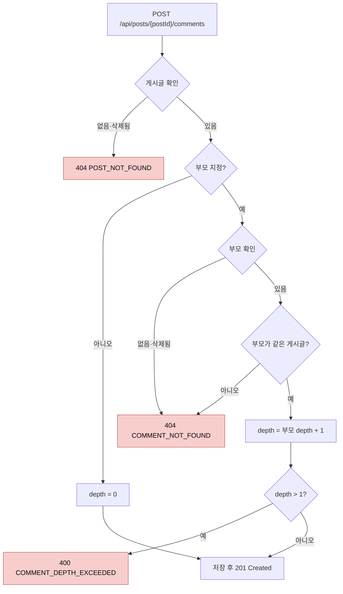

# 댓글 설계 명세서

> [프로젝트 SDS](../../project/sds.md)의 아키텍처와 공통 컴포넌트를 전제로 한다. 이 문서는 `com.board.bbs.comment` 패키지와 화면의 `features/comment`만 다룬다.
>
> **이 문서가 다루지 않는 것:** 메서드 시그니처(코드가 기준), 요청·응답 필드(OpenAPI 문서가 기준), 테스트 목록([QA 체크리스트](qa-checklist.md)가 기준). 작성 기준은 [문서 체계 §8](../../README.md#8-sds-작성-기준)에 있다.

## 1. 설계 개요

댓글은 게시글과 **별개의 애그리게이트**다. 게시글 하나에 댓글이 수백 개 달릴 수 있으므로, 댓글을 게시글 애그리게이트 안에 두면 댓글 하나를 쓸 때마다 게시글 전체를 불러오고 잠가야 한다. 그래서 댓글은 게시글을 **식별자로만 참조**한다.

댓글 기능은 게시글 기능에 다음 두 경로로만 연결된다 ([ADR-0009](../../project/adr/0009-feature-boundaries-via-events.md)).

| 경로 | 방향 | 용도 |
|---|---|---|
| `post`의 `PostQueryService` 호출 | comment → post | 작성과 목록 조회 전에 게시글이 있고 삭제되지 않았는지 확인 |
| `PostDeleted` 이벤트 수신 | post → comment (런타임) | 게시글이 삭제되면 그 댓글을 일괄 삭제 |

## 2. 구성 요소

### 2.1 도메인 (`comment.domain`)

| 요소 | 종류 | 책임 |
|---|---|---|
| `Comment` | 애그리게이트 루트 | 본문 보유. 생성할 때 부모가 같은 게시글인지 검사하고 깊이를 정한다. 수정·삭제 권한과 삭제 상태를 검사한다 |
| `CommentBody` | 값 객체 | 본문 규칙 ([SRS §2](srs.md#2-데이터-항목)) |
| `CommentId` | 값 객체 | 댓글 식별자 |

**부모와 깊이 규칙은 생성 시점에 결정된다.** 도메인이 부모 댓글 자체를 받아 검사하므로, 서비스를 거치지 않는 경로가 생겨도 규칙이 지켜진다.

| 상황 | 결과 |
|---|---|
| 부모 없음 | 원댓글, 깊이 0 |
| 부모가 다른 게시글의 댓글 | `COMMENT_NOT_FOUND`. 다른 게시글의 댓글은 이 게시글에서 보이지 않으므로 없는 댓글과 같게 취급한다 |
| 부모가 원댓글 | 대댓글, 깊이 1 |
| 부모가 대댓글 | `COMMENT_DEPTH_EXCEEDED` |

수정은 작성자만, 삭제는 작성자 또는 관리자만 할 수 있다. 삭제된 댓글은 수정·삭제할 수 없다 (`COMMENT_NOT_FOUND`).

### 2.2 애플리케이션 (`comment.application`)

인바운드 포트는 두지 않는다 ([ADR-0010](../../project/adr/0010-drop-inbound-ports.md)).

| 요소 | 종류 | 책임 |
|---|---|---|
| `CommentCommandService` | 서비스 | 작성, 수정, 삭제, 게시글 단위 일괄 삭제 |
| `CommentQueryService` | 서비스 | 게시글별 목록 조회. 게시글이 없으면 `POST_NOT_FOUND` |
| `CommentRepository` | 아웃바운드 포트 | 댓글 저장·조회, 게시글별 목록(작성 순), 게시글 단위 일괄 소프트 삭제 |

### 2.3 어댑터 (`comment.adapter`)

| 요소 | 위치 | 책임 |
|---|---|---|
| `CommentController` | `in/web` | REST 엔드포인트. 관리자 여부를 정해 서비스에 넘긴다 |
| `PostDeletedListener` | `in/event` | `PostDeleted`를 동기로 받아 일괄 삭제를 요청한다 |
| `CommentPersistenceAdapter` | `out/persistence` | `CommentRepository` 구현 |

## 3. 처리 흐름

### 3.1 작성 (CMT-FR-001, 002, 003, 008)

하나의 트랜잭션에서 다음 순서로 검사한다.

"게시글 확인"은 `post` 기능의 서비스가, "부모 확인"은 저장소가, 같은 게시글 검사와 깊이 계산은 도메인(`Comment`)이 맡는다.

### 3.2 게시글 삭제에 따른 일괄 삭제 (CMT-FR-007)

1. `post` 기능이 게시글을 삭제하고 `PostDeleted`를 발행한다.
2. `PostDeletedListener`가 **같은 트랜잭션에서 동기로** 받아, 그 게시글의 삭제되지 않은 댓글을 게시글 삭제 시각으로 한꺼번에 소프트 삭제한다.
3. 게시글 삭제가 롤백되면 댓글 삭제도 함께 롤백된다.

일괄 UPDATE는 영속성 컨텍스트를 우회하므로 반영 전 변경을 먼저 flush해야 한다 ([코딩 표준 CS-B33](../../project/coding-standards.md#34-영속성)). 그렇지 않으면 같은 트랜잭션에서 앞서 기록한 게시글의 삭제 시각이 유실된다.

### 3.3 목록 (CMT-FR-004)

1. 게시글이 있고 삭제되지 않았는지 확인한다. 아니면 `404 POST_NOT_FOUND`.
2. 그 게시글의 삭제되지 않은 댓글을 작성 순(같으면 식별자 순)으로 페이지 단위로 읽는다. 원댓글과 대댓글을 한 목록에 평면으로 담는다.

부분 인덱스(게시글, 작성 시각, 식별자 / 삭제되지 않은 댓글)가 조건과 정렬을 함께 지원한다.

## 4. 인터페이스 설계

엔드포인트 목록은 [SRS §5](srs.md#5-인터페이스)에, 요청·응답 필드는 OpenAPI 문서에 있다. 필드 목록만으로는 드러나지 않는 의미는 다음과 같다.

- 목록은 트리가 아니라 평면이다. 각 항목의 부모 식별자와 깊이로 관계를 표현한다.
- 응답에 작성자 닉네임이 없다 ([SRS CMT-OPEN-04](srs.md#6-미결-사항)).
- 부모 댓글이 없거나, 삭제되었거나, 다른 게시글의 댓글이면 모두 같은 `COMMENT_NOT_FOUND`다.
- 댓글 기능이 쓰는 오류 코드는 `INVALID_REQUEST`, `UNAUTHENTICATED`, `ACCESS_DENIED`, `POST_NOT_FOUND`, `COMMENT_NOT_FOUND`, `COMMENT_DEPTH_EXCEEDED`다 ([프로젝트 SRS §5.1](../../project/srs.md#51-오류-코드-목록)).

## 5. 데이터 설계

[프로젝트 SDS §5](../../project/sds.md#5-데이터-관점)의 `comment` 테이블을 사용한다. 이 기능에 고유한 데이터 설계는 다음과 같다.

- 깊이는 저장한다. 도메인 규칙과 별도로 데이터베이스의 `CHECK` 제약이 0과 1만 허용한다.
- 부모는 같은 테이블을 가리키는 외래 키다. 같은 게시글인지는 데이터베이스가 아니라 도메인이 검사한다.

## 6. 화면 설계 (`frontend/src/app/features/comment`)

[코딩 표준 CS-F01](../../project/coding-standards.md#5-프론트엔드-규칙)의 구조를 따른다.

| 요소 | 책임 |
|---|---|
| 스토어 (`comment.store.ts`) | 게시글별 댓글 목록을 보유하고, 작성·수정·삭제 후 다시 불러온다 |
| 댓글 영역 | 목록과 입력란을 배치한다 |
| 댓글 항목 | 깊이 1이면 들여 쓴다. 원댓글에만 답글 버튼, 작성자에게만 수정·삭제를 보여 준다 |
| 입력 폼 | 등록에 성공하면 입력란을 비운다 |

화면은 서버가 준 순서 그대로 표시하고 깊이로만 들여쓰기를 한다. 대댓글을 부모 아래로 묶지 않는다 ([SRS CMT-OPEN-03](srs.md#6-미결-사항)).

## 7. 설계 결정

| 결정 | 이유 | 대안과 기각 이유 |
|---|---|---|
| 댓글을 별도 애그리게이트로 두고 게시글을 식별자로 참조 | 댓글 작성이 게시글을 잠그거나 전체를 불러오지 않는다 | 게시글 애그리게이트에 포함: 댓글 수에 비례해 비용 증가 |
| 깊이를 저장하고 생성 시점에 결정 | 목록 조회 시 재귀 없이 깊이를 알 수 있다 | 매번 부모를 따라 계산: 조회 비용 증가 |
| 같은 게시글 검사를 도메인에서 함 | 서비스를 우회하는 경로가 생겨도 규칙이 지켜진다 | 서비스에서 검사: [ADR-0003](../../project/adr/0003-authorization-in-domain.md)과 같은 이유로 기각 |
| 다른 게시글의 부모를 `COMMENT_NOT_FOUND`로 거부 | 다른 게시글의 댓글 존재 여부를 노출하지 않는다 | `INVALID_REQUEST`: 존재를 암시한다. 새 오류 코드: 클라이언트가 구분할 필요가 없다 |
| 게시글 삭제 시 이벤트로 일괄 소프트 삭제 | 기능 사이의 순환 제거, 같은 트랜잭션 보장 | [ADR-0009](../../project/adr/0009-feature-boundaries-via-events.md) |
| 목록을 평면 구조로 반환 | 페이징이 단순하다 | 트리 구조 반환: 페이지 경계에서 원댓글과 답글이 갈라지는 문제를 따로 풀어야 한다 |

## 8. 요구사항 대응표

요구사항을 어떤 설계 요소가 맡는지 보여 준다. 검증하는 테스트는 [QA 체크리스트](qa-checklist.md)에 있다.

| 요구사항 | 설계 요소 |
|---|---|
| CMT-FR-001 | `CommentCommandService`, `post`의 `PostQueryService`, `CommentBody` (§3.1) |
| CMT-FR-002, 003, 008 | `Comment` (부모와 깊이 규칙, §2.1), 깊이 `CHECK` 제약 |
| CMT-FR-004 | `CommentQueryService`, `CommentRepository` (§3.3) |
| CMT-FR-005, 006 | `Comment` (수정·삭제 규칙) |
| CMT-FR-007 | `PostDeletedListener`, `CommentRepository`의 일괄 삭제 (§3.2) |
| CMT-FR-020~023 | `features/comment` 화면 요소 (§6) |

## 변경 이력

| 버전 | 일자 | 변경 내용 | 작성자 |
|---|---|---|---|
| 1.0.0 | 2026-10-09 | 최초 작성 (`main` e96a878 기준으로 역작성) | HseongH |
| 1.1.0 | 2026-10-09 | 인바운드 포트 제거와 저장소 포트 통합 반영 (ADR-0010). 작성 흐름을 Mermaid 다이어그램으로 교체 | HseongH |
| 1.2.0 | 2026-10-09 | `Comment.write`가 부모 댓글을 받아 같은 게시글인지 검사하도록 변경(CMT-FR-008). 목록 조회가 게시글 존재를 확인 | HseongH |
| 1.3.0 | 2026-10-09 | 세밀도 조정: 메서드 시그니처, 응답 필드 예시, SQL 원문, 테스트 목록을 빼고 책임·흐름·결정 중심으로 재작성. 목록 흐름에 게시글 확인 단계 반영, 오류 코드 선택 근거를 설계 결정에 추가 | HseongH |
