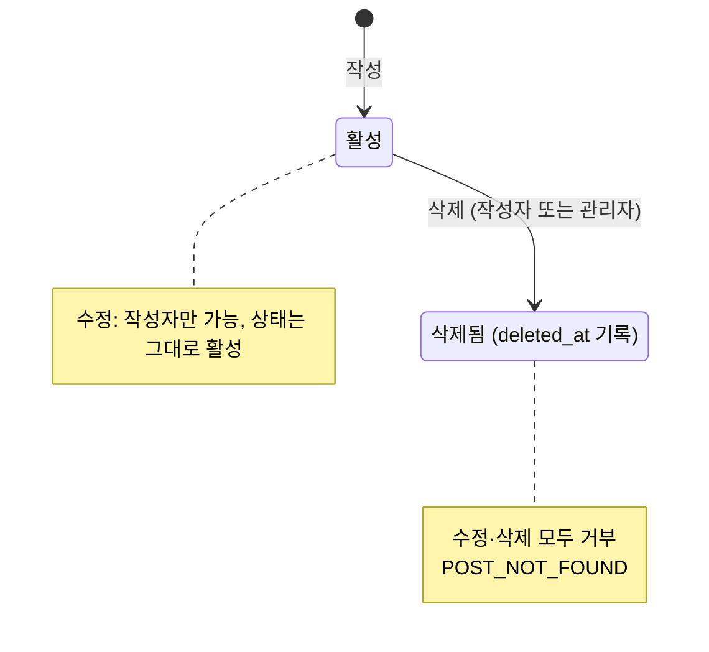
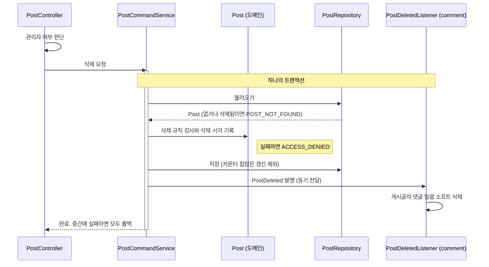

# 게시글 설계 명세서

> [프로젝트 SDS](../../project/sds.md)의 아키텍처와 공통 컴포넌트를 전제로 한다. 이 문서는 `com.board.bbs.post` 패키지와 화면의 `features/post`만 다룬다.
>
> **이 문서가 다루지 않는 것:** 메서드 시그니처(코드가 기준), 요청·응답 필드(OpenAPI 문서 `/v3/api-docs`가 기준), 테스트 목록([QA 체크리스트](qa-checklist.md)가 기준). 작성 기준은 [문서 체계 §8](../../README.md#8-sds-작성-기준)에 있다.

## 1. 설계 개요

게시글 기능은 `Post` 애그리게이트 하나와, 그 주변의 두 가지 부가 기능(조회수, 좋아요)으로 이루어진다. 설계의 핵심은 **카운터를 애그리게이트의 일반 상태 변경 경로에서 분리한 것**이다. 제목과 본문은 도메인 객체를 통해 바꾸고, 카운터는 원자적 UPDATE로만 바꾼다.

## 2. 구성 요소

### 2.1 도메인 (`post.domain`)

| 요소 | 종류 | 책임 |
|---|---|---|
| `Post` | 애그리게이트 루트 | 제목·본문 보유. 수정·삭제 권한과 삭제 상태를 검사한다. 카운터는 읽기만 한다 |
| `Title`, `Content` | 값 객체 | 제목과 본문의 규칙 ([SRS §2](srs.md#2-데이터-항목)) |
| `PostId` | 값 객체 | 게시글 식별자. 다른 기능은 이 타입으로만 게시글을 참조한다 |
| `PostDeleted` | 도메인 이벤트 | 게시글이 삭제되었음을 다른 기능에 알린다 |

`Post`의 상태 전이:

권한 규칙의 핵심은 **관리자는 삭제만 할 수 있고 수정은 할 수 없다**는 것이다. 그래서 수정 메서드는 관리자 여부를 인자로 받지 않는다.

### 2.2 애플리케이션 (`post.application`)

인바운드 포트는 두지 않는다. 컨트롤러와 다른 기능은 서비스를 직접 사용한다 ([ADR-0010](../../project/adr/0010-drop-inbound-ports.md)).

| 요소 | 종류 | 책임 |
|---|---|---|
| `PostCommandService` | 서비스 | 작성, 수정, 삭제. 삭제할 때 `PostDeleted`를 발행한다 |
| `PostQueryService` | 서비스 | 단건 조회, 조회수 증가를 포함한 상세 조회, 목록 검색. **`comment` 기능도 쓴다**: 댓글 목록 조회 전에 게시글 존재를 확인하고, 댓글 작성 전에는 게시글이 작성 트랜잭션 동안 삭제되지 않도록 공유 잠금으로 확인한다 |
| `PostLikeService` | 서비스 | 좋아요와 취소. 좋아요 행과 카운터를 한 트랜잭션에서 바꾼다 |
| `PostRepository` | 아웃바운드 포트 | 게시글 저장·조회·검색, 카운터의 원자적 증감, 삭제되지 않았는지 공유 잠금으로 확인 |
| `PostLikeRepository` | 아웃바운드 포트 | 좋아요 행 추가·삭제. 실제로 바뀌었는지를 돌려준다 |
| `ViewDeduplicationPort` | 아웃바운드 포트 | 처음 보는 조회인지 판정하고 기록한다. 롤백되면 기록을 지운다 |
| `PostSearchCondition`, `PostSummary` | 읽기 모델 | 검색 조건(키워드 정규화 포함), 본문 없는 목록 항목 |

### 2.3 어댑터 (`post.adapter`)

| 요소 | 위치 | 책임 |
|---|---|---|
| `PostController` | `in/web` | REST 엔드포인트. 관리자 여부와 조회자 키를 정해 서비스에 넘긴다 |
| `PostPersistenceAdapter` | `out/persistence` | `PostRepository` 구현. 엔티티 매핑, 원자적 카운터 UPDATE |
| `PostQueryRepository` | `out/persistence` | 목록 검색 쿼리. `member`를 조인해 닉네임을 함께 읽는다 (기능 경계 규칙의 허용된 예외) |
| `PostLikePersistenceAdapter` | `out/persistence` | `PostLikeRepository` 구현. 중복은 데이터베이스가 판정한다 |
| `RedisViewDeduplicationAdapter` | `out/redis` | `ViewDeduplicationPort` 구현. Valkey의 TTL 키로 24시간 중복을 판정한다 |

## 3. 처리 흐름

### 3.1 상세 조회와 조회수 (PST-FR-002, 003)

하나의 쓰기 트랜잭션에서 다음 순서로 처리한다.

1. 컨트롤러가 조회자 키를 정한다. 회원이면 회원 식별자, 비회원이면 세션 식별자를 쓴다.
2. 게시글을 불러온다. 없거나 삭제되었으면 `404 POST_NOT_FOUND`로 끝난다.
3. 조회자 키로 처음 보는 조회인지 판정한다. 처음이면 조회수를 원자적으로 1 올린다.
   - 판정 기록은 Valkey에 있어 데이터베이스 트랜잭션과 함께 롤백되지 않는다. 그래서 기록을 남긴 직후 트랜잭션 완료 콜백을 등록하고, 롤백되면 기록을 지운다.
   - 커밋 결과를 알 수 없는 경우에는 기록을 지우지 않는다. 같은 조회자의 두 요청이 겹쳐서, 한쪽이 롤백되기 전에 다른 쪽이 기록 때문에 집계되지 않는 경우도 막지 않는다. 둘 다 조회 1회를 놓치는 정도이므로 받아들인다.
4. **2단계에서 불러온 게시글을 반환한다.** 그래서 응답의 조회수는 이번 조회가 반영되기 전 값이다.

### 3.2 삭제 (PST-FR-006)

### 3.3 좋아요 (PST-FR-007, 008)

좋아요와 취소는 각각 하나의 트랜잭션에서 다음 순서로 처리한다.

1. 게시글을 불러온다. 없거나 삭제되었으면 `404`로 끝난다.
2. 좋아요 행을 추가(또는 삭제)한다. 중복 판정은 데이터베이스의 유니크 제약이 하고, **실제로 바뀐 행이 없으면** `409 ALREADY_LIKED`(또는 `NOT_LIKED`)로 끝난다.
3. 좋아요 수를 원자적으로 1 올린다(또는 내린다). 내릴 때는 0 아래로 내려가지 않게 조건을 건다.

2단계에서 실패하면 3단계를 실행하지 않으므로, 동시에 여러 번 눌러도 좋아요 행과 카운터가 어긋나지 않는다.

### 3.4 목록 검색 (PST-FR-004, 009, 010)

| 설계 요소 | 내용 | 이유 |
|---|---|---|
| 조회 대상 | 본문을 뺀 프로젝션, `member` 조인으로 닉네임 포함 | 큰 본문을 읽지 않고, N+1 쿼리를 막는다 |
| 조건 | 삭제되지 않은 글. 키워드는 제목 또는 본문에 대소문자 무시 포함. 작성자 조건은 선택 | SRS 수용 기준 |
| 정렬 | 작성 시각 내림차순, 같으면 식별자 내림차순 | 페이지 경계에서 중복·누락 방지 |
| 건수 | 별도 count 쿼리. 마지막 페이지처럼 건수를 알 수 있으면 생략 | 불필요한 count 실행 방지 |
| 인덱스 | 삭제되지 않은 글에 대한 부분 인덱스 (작성 시각, 식별자) | 정렬과 조건을 함께 지원 |

## 4. 인터페이스 설계

엔드포인트 목록은 [SRS §5](srs.md#5-인터페이스)에, 요청·응답 필드는 OpenAPI 문서(`/v3/api-docs`)에 있다. 이 절에는 필드 목록만으로는 드러나지 않는 의미만 적는다.

- 목록 응답에는 본문이 없고 작성자 닉네임이 있다. 상세 응답은 그 반대다 ([SRS PST-OPEN-01](srs.md#6-미결-사항)).
- 상세 응답의 조회수는 이번 조회가 반영되기 전 값이다 (§3.1).
- 오류는 공통 ProblemDetail 규약을 따른다. 게시글 기능이 쓰는 오류 코드는 `INVALID_REQUEST`, `UNAUTHENTICATED`, `ACCESS_DENIED`, `POST_NOT_FOUND`, `ALREADY_LIKED`, `NOT_LIKED`다 ([프로젝트 SRS §5.1](../../project/srs.md#51-오류-코드-목록)).

## 5. 데이터 설계

[프로젝트 SDS §5](../../project/sds.md#5-데이터-관점)의 `post`, `post_like` 테이블과 Valkey 키 `post:view:{postId}:{viewerKey}`를 사용한다. 이 기능에 고유한 데이터 설계는 다음과 같다.

- `view_count`, `like_count`는 비정규화한 카운터다. 엔티티 저장에서 제외하고 원자적 UPDATE로만 바꾼다 ([ADR-0004](../../project/adr/0004-atomic-counter-update.md)).
- `post_like`의 `(post_id, member_id)` 유니크 제약이 중복 좋아요를 최종 판정한다 ([ADR-0005](../../project/adr/0005-database-decides-duplicates.md)).

## 6. 화면 설계 (`services/web/src/app/features/post`)

[코딩 표준 CS-F01](../../project/coding-standards.md#5-프론트엔드-규칙)의 구조(API 서비스, 스토어, 페이지, 컴포넌트)를 따른다.

| 요소 | 책임 |
|---|---|
| 스토어 (`post.store.ts`) | 목록·상세 자원을 보유하고, 검색 조건이 바뀌면 다시 불러온다. 변경 후 무효화 범위를 소유한다 |
| 목록 페이지 | URL 쿼리(검색어, 페이지)를 입력으로 받아 목록을 보여 준다 |
| 상세 페이지 | 상세, 좋아요, 댓글 영역을 배치한다. 수정·삭제는 작성자에게만 보인다 |
| 작성·수정 페이지 | 로그인한 사용자만 들어갈 수 있다. 서버 검증 오류를 입력란 아래에 보여 준다 |
| 좋아요 버튼 | 누르면 숫자를 먼저 올리고, 실패하면 오류 메시지를 보여 준다 |

## 7. 설계 결정

기능 내부에서 끝나는 결정이다. 프로젝트 전체에 영향을 주는 결정은 ADR로 링크했다.

| 결정 | 이유 | 대안과 기각 이유 |
|---|---|---|
| 카운터는 원자적 UPDATE로만 바꾸고 엔티티 갱신에서 제외 | 동시 요청에서 값을 잃지 않는다 | [ADR-0004](../../project/adr/0004-atomic-counter-update.md) |
| 좋아요 중복은 `ON CONFLICT`의 영향 행 수로 판정 | 예외 없이 결과로 판정, 트랜잭션 유지 | [ADR-0005](../../project/adr/0005-database-decides-duplicates.md) |
| 목록은 본문 없는 별도 프로젝션 | 목록에서 최대 10,000자 본문을 읽지 않는다 | 엔티티 조회 후 변환: 불필요한 데이터 전송, N+1 위험 |
| 정렬에 식별자를 함께 사용 | 같은 시각에 작성된 행의 순서를 고정해 페이지 경계 중복·누락 방지 | 작성 시각만 사용: 순서가 비결정적 |
| 비회원 조회자 키로 세션 ID 사용 | 별도 식별 수단 없이 중복 조회를 구분 | IP 주소: 공유 IP에서 서로 다른 사용자를 같은 사람으로 판정 |
| 조회수 롤백 시 판정 기록을 지우는 보상 처리 | 조회수 반영이 실패했는데 기록만 남으면 그 조회자는 24시간 동안 집계되지 않는다 | 커밋 후에 기록: 기록 전에 같은 조회자의 동시 요청이 모두 판정을 통과해 중복 집계된다. Valkey에 모았다가 주기적으로 반영: 현재 규모에 비해 구성이 크다 |
| 상세 조회 응답에 증가 전 조회수를 담음 | 증가 후 값을 다시 읽는 쿼리를 아낀다 | 증가 후 재조회: 쿼리 1회 추가, 동시 요청에서는 어차피 정확한 값이 아니다 |
| 관리자 여부를 컨트롤러에서 판단해 `boolean`으로 전달 | 도메인이 스프링 보안을 모르게 한다 | [ADR-0003](../../project/adr/0003-authorization-in-domain.md) |

## 8. 요구사항 대응표

요구사항을 어떤 설계 요소가 맡는지 보여 준다. 검증하는 테스트는 [QA 체크리스트](qa-checklist.md)에 있다.

| 요구사항 | 설계 요소 |
|---|---|
| PST-FR-001 | `Post`, `Title`, `Content`, `PostCommandService` |
| PST-FR-002, 003 | `PostQueryService`, `ViewDeduplicationPort` (§3.1) |
| PST-FR-004, 009, 010 | `PostQueryRepository`, `PostSearchCondition` (§3.4) |
| PST-FR-005 | `Post` (수정 규칙) |
| PST-FR-006 | `Post` (삭제 규칙), `PostDeleted`, `comment`의 `PostDeletedListener` (§3.2) |
| PST-FR-007, 008 | `PostLikeService`, `PostLikeRepository` (§3.3) |
| PST-FR-011 | 카운터 컬럼의 갱신 제외 (§5) |
| PST-FR-020~024 | `features/post` 화면 요소 (§6) |

## 변경 이력

| 버전 | 일자 | 변경 내용 | 작성자 |
|---|---|---|---|
| 1.0.0 | 2026-10-09 | 최초 작성 (`main` e96a878 기준으로 역작성) | HseongH |
| 1.1.0 | 2026-10-09 | 인바운드 포트 제거와 저장소 포트 통합 반영 (ADR-0010). 상태 전이와 삭제 흐름을 Mermaid 다이어그램으로 교체 | HseongH |
| 1.1.1 | 2026-10-09 | 조회수 키 저장소 표기를 Valkey로 정정 (ADR-0013) | HseongH |
| 1.2.0 | 2026-10-09 | 세밀도 조정: 메서드 시그니처, 응답 필드 예시, SQL 원문, 테스트 목록을 빼고 책임·흐름·결정 중심으로 재작성. 설계 내용은 바뀌지 않음 | HseongH |
| 1.3.0 | 2026-10-09 | 상세 조회: 조회수 반영이 롤백되면 중복 판정 기록을 지우는 보상 처리 추가 (PST-SRS 1.1.0). `PostQueryService`에 댓글 작성용 공유 잠금 확인 추가 (CMT-SDS 1.5.0) | HseongH |
| 1.3.1 | 2026-10-09 | 화면 설계 절의 경로를 `services/web/`으로 정정 (모노레포 전환, ADR-0014). 의미 변경 없음 | HseongH |
