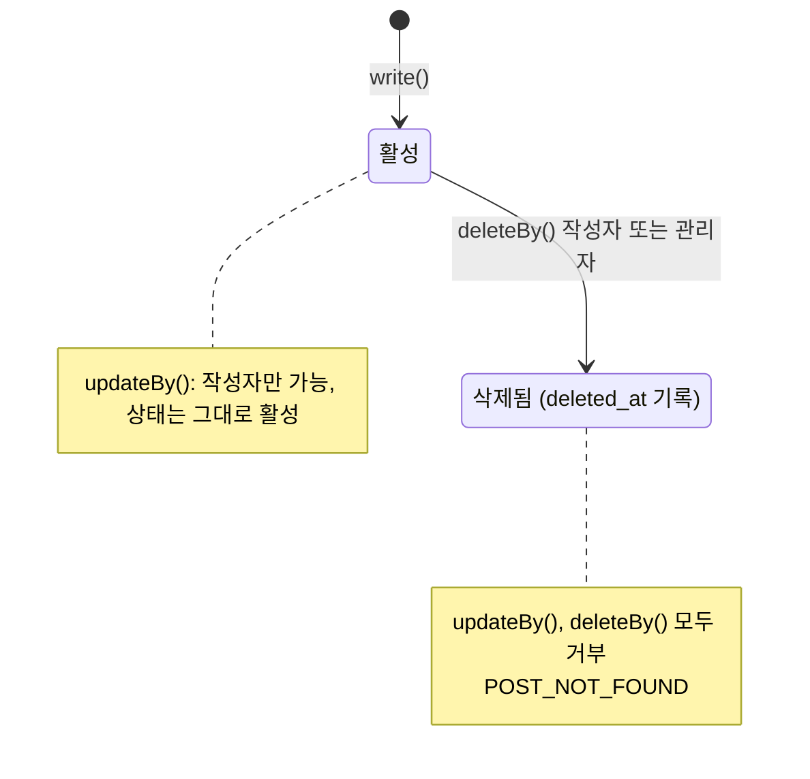
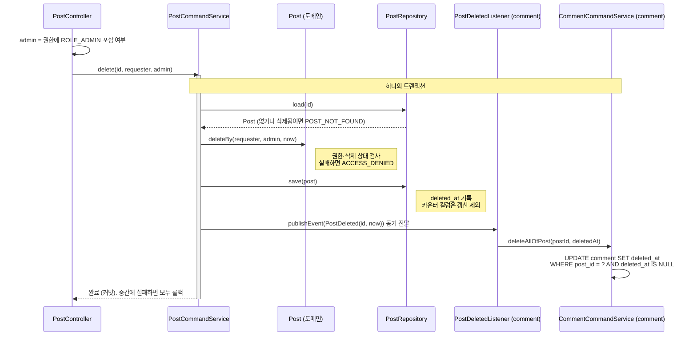

# 게시글 설계 명세서

> [프로젝트 SDS](../../project/sds.md)의 아키텍처와 공통 컴포넌트를 전제로 한다. 이 문서는 `com.board.bbs.post` 패키지와 화면의 `features/post`만 다룬다.

## 1. 설계 개요

게시글 기능은 `Post` 애그리게이트 하나와, 그 주변의 두 가지 부가 기능(조회수, 좋아요)으로 이루어진다. 설계의 핵심은 **카운터를 애그리게이트의 일반 상태 변경 경로에서 분리한 것**이다. 제목과 본문은 도메인 객체를 통해 바꾸고, 카운터는 원자적 UPDATE로만 바꾼다.

## 2. 구성 요소

### 2.1 도메인 (`post.domain`)

| 요소 | 종류 | 책임 |
|---|---|---|
| `Post` | 애그리게이트 루트 | 제목·본문 보유, 수정·삭제 권한과 삭제 상태 검사 |
| `PostId` | 값 객체 | 1 이상의 식별자 |
| `Title` | 값 객체 | 공백 제거 후 1~100자 |
| `Content` | 값 객체 | 공백만은 불가, 최대 10,000자 (공백 제거 안 함) |
| `PostDeleted` | 도메인 이벤트 | 게시글이 삭제되었음을 다른 기능에 알린다 (`postId`, `deletedAt`) |

`Post`의 상태 전이:



| 메서드 | 사전 조건 | 실패 |
|---|---|---|
| `updateBy(requester, title, content)` | 삭제되지 않음, `requester == authorId` | 삭제됨 → `POST_NOT_FOUND`, 작성자 아님 → `ACCESS_DENIED` |
| `deleteBy(requester, admin, now)` | 삭제되지 않음, `admin` 또는 `requester == authorId` | 위와 같음 |

조회수와 좋아요 수는 `Post`에 읽기 전용으로만 존재한다. `Post`에는 카운터를 바꾸는 메서드가 없다.

### 2.2 애플리케이션 (`post.application`)

**애플리케이션 서비스 (웹 어댑터와 다른 기능에 공개)**

인바운드 포트는 두지 않는다. 컨트롤러와 다른 기능은 서비스를 직접 사용한다 ([ADR-0010](../../project/adr/0010-drop-inbound-ports.md)).

| 서비스 | 메서드 | 트랜잭션 |
|---|---|---|
| `PostCommandService` | `create(author, title, content) → PostId` | 쓰기 |
| | `update(id, requester, title, content)` | 쓰기 |
| | `delete(id, requester, admin)` | 쓰기, `PostDeleted` 발행 |
| `PostQueryService` | `getById(id) → Post` | 읽기 전용 |
| | `getAndCountView(id, viewerKey) → Post` | 쓰기 (조회수 증가) |
| | `search(condition, pageable) → Page<PostSummary>` | 읽기 전용 |
| `PostLikeService` | `like(postId, memberId)`, `unlike(postId, memberId)` | 쓰기 |

`PostQueryService.getById`는 `comment` 기능이 게시글 존재를 확인하는 데에도 사용한다 ([ADR-0009](../../project/adr/0009-feature-boundaries-via-events.md)).

**아웃바운드 포트 (기능 내부)**

| 포트 | 메서드 | 어댑터 |
|---|---|---|
| `PostRepository` | `save`(카운터 제외), `load`(삭제되지 않은 글, 없으면 `POST_NOT_FOUND`), `search`, `increaseViewCount`, `increaseLikeCount`, `decreaseLikeCount`(원자적) | `PostPersistenceAdapter` (→ `PostQueryRepository`) |
| `PostLikeRepository` | `like`, `unlike` (실제로 바뀌었는지 반환) | `PostLikePersistenceAdapter` |
| `ViewDeduplicationPort` | `markViewed` (처음 보는 조회인지 판정하고 기록) | `RedisViewDeduplicationAdapter` |

**읽기 모델**

| 타입 | 용도 |
|---|---|
| `PostSearchCondition(keyword, authorId)` | 검색 조건. 생성 시 키워드를 정규화한다 (공백 제거, 빈 값은 `null`) |
| `PostSummary` | 목록 항목. 본문 없음, 작성자 닉네임 포함 |

### 2.3 어댑터 (`post.adapter`)

| 요소 | 위치 | 책임 |
|---|---|---|
| `PostController` | `in/web` | REST 엔드포인트, 관리자 여부 판단, 조회자 키 생성 |
| `CreatePostRequest`, `UpdatePostRequest` | `in/web/dto` | 입력 검증 (`@NotBlank`, `@Size`) |
| `PostResponse`, `PostSummaryResponse` | `in/web/dto` | 응답 직렬화 |
| `PostJpaEntity`, `PostLikeJpaEntity` | `out/persistence` | 테이블 매핑. 카운터 컬럼은 `updatable = false` |
| `PostJpaRepository` | `out/persistence` | 기본 조회, 원자적 카운터 UPDATE |
| `PostLikeJpaRepository` | `out/persistence` | `INSERT ... ON CONFLICT DO NOTHING`, `DELETE` (네이티브) |
| `PostQueryRepository` | `out/persistence` | QueryDSL 목록 검색, `member` 조인 |
| `PostMapper` | `out/persistence` | 도메인 ↔ 엔티티 변환 |
| `RedisViewDeduplicationAdapter` | `out/redis` | `SETNX` + 24시간 TTL |

## 3. 처리 흐름

### 3.1 상세 조회와 조회수 (PST-FR-002, 003)

```
PostController.get(id, viewer?)
  viewerKey = viewer ? "m{memberId}" : "s{sessionId}"
  └─ PostQueryService.getAndCountView(id, viewerKey)        [트랜잭션]
       ├─ PostRepository.load(id)                               없거나 삭제됨 → 404
       ├─ ViewDeduplicationPort.markViewed(id, viewerKey)     Redis SET NX EX 86400
       │    └─ true (처음)  → PostRepository.increaseViewCount(id)
       │                       UPDATE post SET view_count = view_count + 1
       └─ 불러온 Post 반환 (조회수는 증가 전 값)
```

### 3.2 삭제 (PST-FR-006)



### 3.3 좋아요 (PST-FR-007, 008)

```
PostLikeService.like(postId, memberId)                     [트랜잭션]
  ├─ PostRepository.load(postId)                              없거나 삭제됨 → 404
  ├─ PostLikeRepository.like(postId, memberId)
  │    INSERT INTO post_like ... ON CONFLICT DO NOTHING     영향 행 0 → ALREADY_LIKED (409)
  └─ PostRepository.increaseLikeCount(postId)
       UPDATE post SET like_count = like_count + 1

PostLikeService.unlike(postId, memberId)                   [트랜잭션]
  ├─ PostRepository.load(postId)
  ├─ PostLikeRepository.unlike(...)  DELETE ...                  영향 행 0 → NOT_LIKED (409)
  └─ PostRepository.decreaseLikeCount(postId)
       UPDATE post SET like_count = like_count - 1 WHERE ... AND like_count > 0
```

### 3.4 목록 검색 (PST-FR-004, 009, 010)

```sql
-- 데이터 쿼리
SELECT p.id, p.title, p.author_id, m.nickname, p.view_count, p.like_count, p.created_at
FROM post p JOIN member m ON m.id = p.author_id
WHERE p.deleted_at IS NULL
  [AND (lower(p.title) LIKE %kw% OR lower(p.content) LIKE %kw%)]
  [AND p.author_id = ?]
ORDER BY p.created_at DESC, p.id DESC
OFFSET ? LIMIT ?

-- 건수 쿼리 (마지막 페이지이고 건수를 알 수 있으면 생략)
SELECT count(*) FROM post p WHERE <같은 조건>
```

건수 쿼리는 `PageableExecutionUtils.getPage`로 필요할 때만 실행한다.

## 4. 인터페이스 설계

### 4.1 요청

| API | 본문 / 파라미터 |
|---|---|
| `POST /api/posts`, `PATCH /api/posts/{id}` | `{ "title": string(1..100), "content": string(1..10000) }` |
| `GET /api/posts` | `keyword?`, `authorId?`, `page`(기본 0), `size`(기본 20) |

### 4.2 응답

```jsonc
// GET /api/posts/{id} → PostResponse
{ "id": 1, "title": "제목", "content": "본문", "authorId": 7,
  "viewCount": 3, "likeCount": 1, "createdAt": "2026-10-09T01:23:45Z" }

// GET /api/posts → PageResponse<PostSummaryResponse>
{ "content": [ { "id": 1, "title": "제목", "authorId": 7, "authorNickname": "tester",
                 "viewCount": 3, "likeCount": 1, "createdAt": "..." } ],
  "page": 0, "size": 20, "totalElements": 1, "totalPages": 1, "last": true }
```

### 4.3 오류

| 상황 | 상태 | code |
|---|---|---|
| 입력 규칙 위반 | 400 | `INVALID_REQUEST` (+ `errors`) |
| 미인증 | 401 | `UNAUTHENTICATED` |
| 작성자 아님 | 403 | `ACCESS_DENIED` |
| 없거나 삭제된 게시글 | 404 | `POST_NOT_FOUND` |
| 중복 좋아요 | 409 | `ALREADY_LIKED` |
| 좋아요하지 않은 글 취소 | 409 | `NOT_LIKED` |

## 5. 데이터 설계

[프로젝트 SDS §5](../../project/sds.md#5-데이터-관점)의 `post`, `post_like` 테이블과 Redis 키 `post:view:{postId}:{viewerKey}`를 사용한다. 게시글 기능이 소유하는 마이그레이션은 `V2__create_post.sql`, `V4__create_post_like.sql`이다.

## 6. 화면 설계 (`frontend/src/app/features/post`)

| 요소 | 책임 |
|---|---|
| `post-api.service.ts` | HTTP 호출만 담당 (생성된 API 타입 사용) |
| `post.store.ts` | 목록·상세 자원 보유, 검색 조건 변경 시 재조회, 변경 후 무효화 |
| `pages/post-list-page` | URL 쿼리(`keyword`, `page`)를 입력으로 받아 목록 표시 |
| `pages/post-detail-page` | 상세, 좋아요, 댓글 영역 배치. 작성자에게만 수정·삭제 |
| `pages/post-new-page`, `pages/post-edit-page` | 작성·수정. `authGuard`로 보호 |
| `components/post-form` | 입력 폼, 서버 필드 오류 표시 |
| `components/like-button` | 누르면 숫자를 먼저 올리고, 실패하면 오류 메시지 표시 |
| `components/search-form`, `pagination`, `post-list`, `post-detail` | 표시 전용 |

검색 조건을 URL에 두는 이유는 새로고침과 링크 공유에서 상태를 잃지 않기 위해서다 (PST-FR-020).

## 7. 설계 결정

기능 내부에서 끝나는 결정이다. 프로젝트 전체에 영향을 주는 결정은 ADR로 링크했다.

| 결정 | 이유 | 대안과 기각 이유 |
|---|---|---|
| 카운터는 원자적 UPDATE로만 바꾸고 엔티티 갱신에서 제외 | 동시 요청에서 값을 잃지 않는다 | [ADR-0004](../../project/adr/0004-atomic-counter-update.md) |
| 좋아요 중복은 `ON CONFLICT`의 영향 행 수로 판정 | 예외 없이 결과로 판정, 트랜잭션 유지 | [ADR-0005](../../project/adr/0005-database-decides-duplicates.md) |
| 목록은 본문 없는 별도 프로젝션 | 목록에서 최대 10,000자 본문을 읽지 않는다 | 엔티티 조회 후 변환: 불필요한 데이터 전송, N+1 위험 |
| 정렬에 식별자를 함께 사용 | 같은 시각에 작성된 행의 순서를 고정해 페이지 경계 중복·누락 방지 | 작성 시각만 사용: 순서가 비결정적 |
| 비회원 조회자 키로 세션 ID 사용 | 별도 식별 수단 없이 중복 조회를 구분 | IP 주소: 공유 IP에서 서로 다른 사용자를 같은 사람으로 판정 |
| 관리자 여부를 컨트롤러에서 판단해 `boolean`으로 전달 | 도메인이 스프링 보안을 모르게 한다 | [ADR-0003](../../project/adr/0003-authorization-in-domain.md) |

## 8. 요구사항 대응표

| 요구사항 | 설계 요소 | 자동 테스트 |
|---|---|---|
| PST-FR-001 | `Post.write`, `Title`, `Content`, `CreatePostRequest` | `PostTest`, `PostControllerTest` |
| PST-FR-002 | `PostQueryService.getAndCountView`, `PostRepository.load` | `PostControllerTest`, `PostPersistenceAdapterTest` |
| PST-FR-003 | `ViewDeduplicationPort`, `PostRepository.increaseViewCount` | `PostControllerTest#게시글을_조회하면_조회수가_올라간다` |
| PST-FR-004, 009, 010 | `PostQueryRepository`, `PostSearchCondition` | `PostQueryRepositoryTest` |
| PST-FR-005 | `Post.updateBy` | `PostTest`, `PostControllerTest` |
| PST-FR-006 | `Post.deleteBy`, `PostDeleted`, `PostDeletedListener` | `PostTest`, `PostDeletionIntegrationTest` |
| PST-FR-007, 008 | `PostLikeService`, `PostLikeRepository`, `PostRepository` | `PostControllerTest`, `PostLikeConcurrencyTest` |
| PST-FR-011 | `PostJpaEntity`의 `updatable = false` | `PostCounterPreservationTest` |
| PST-FR-020~024 | `features/post` 화면 요소 | `post-list-page.spec`, `post-detail-page.spec`, `post-form.spec`, `like-button.spec`, `post.store.spec`, `auth.guard.spec`, E2E |

테스트 단위의 상세 대응은 [QA 체크리스트](qa-checklist.md)에 있다.

## 변경 이력

| 버전 | 일자 | 변경 내용 | 작성자 |
|---|---|---|---|
| 1.0.0 | 2026-10-09 | 최초 작성 (`main` e96a878 기준으로 역작성) | HseongH |
| 1.1.0 | 2026-10-09 | 인바운드 포트 제거와 저장소 포트 통합 반영 (ADR-0010). 상태 전이와 삭제 흐름을 Mermaid 다이어그램으로 교체 | HseongH |
