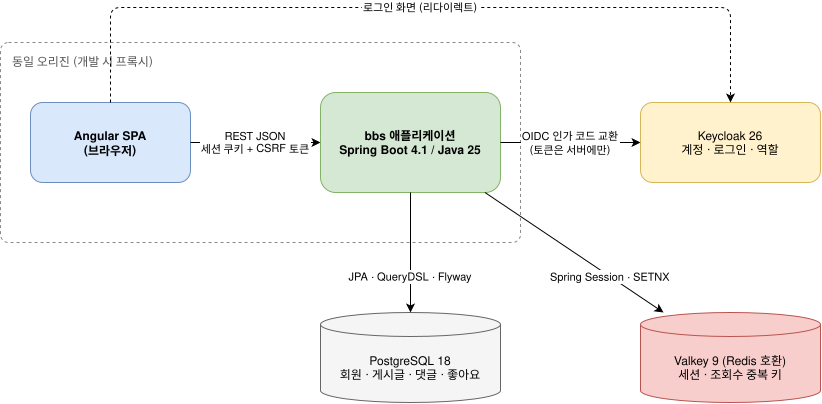
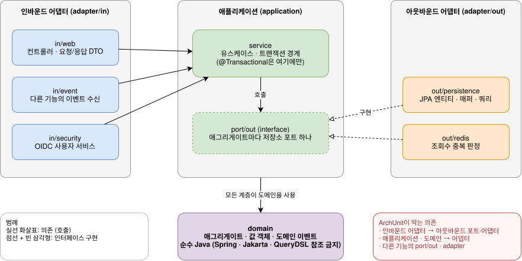
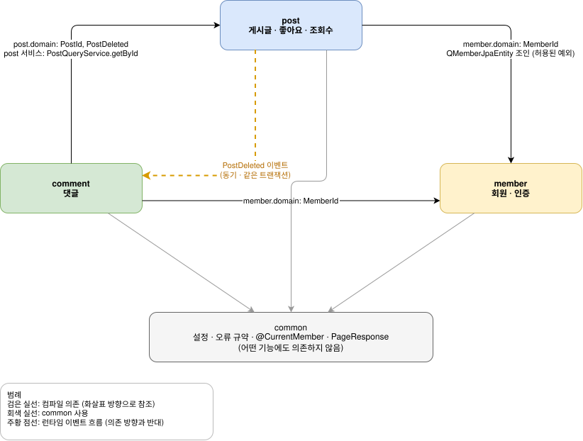
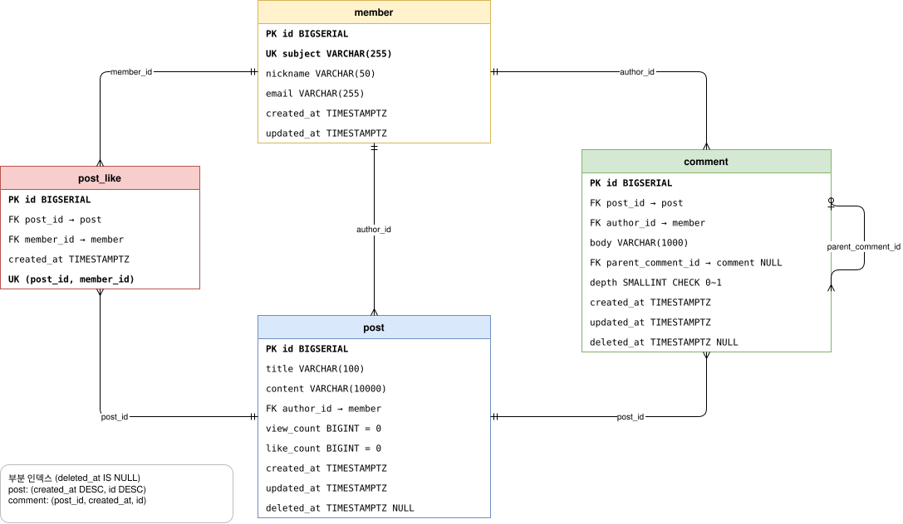
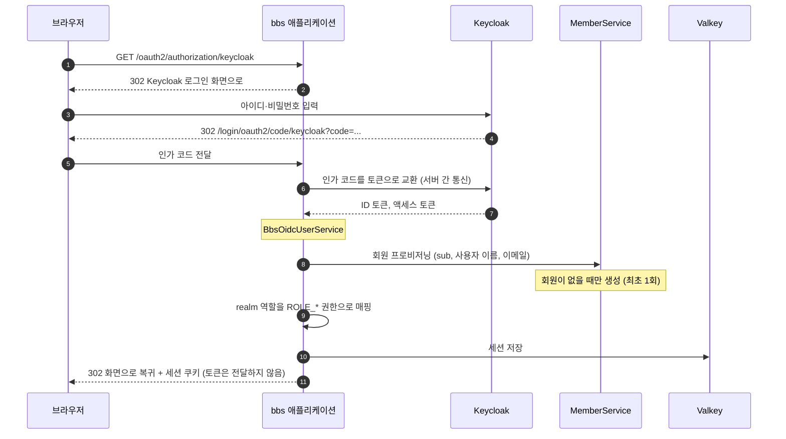

# 게시판(bbs) 프로젝트 설계 명세서

> IEEE 1016의 설계 관점(context, composition, dependency, information, interface, interaction) 중 **프로젝트 전체에 해당하는 부분**을 담는다. 아키텍처 기술(ISO/IEC/IEEE 42010)도 이 문서에 포함했다. 기능별 상세 설계는 각 기능 SDS에 있다.
>
> **이 문서가 다루지 않는 것:** 라이브러리와 이미지의 세부 버전(`gradle/libs.versions.toml`, `deploy/compose.yaml`, `services/web/package.json`이 기준), 테이블의 컬럼 정의(Flyway 마이그레이션이 기준), 품질 게이트와 코딩 규칙([코딩 표준](coding-standards.md)이 기준). 작성 기준은 [문서 체계 §8](../README.md#8-sds-작성-기준)에 있다.

## 1. 개요

### 1.1 설계 목표

[프로젝트 SRS](srs.md)의 공통 요구사항 가운데 설계에 가장 큰 영향을 준 것은 다음 세 가지다.

| 설계 목표 | 근거 요구사항 | 설계 수단 |
|---|---|---|
| 규칙에 우회 경로가 없다 | COM-NFR-005 | 규칙과 권한을 도메인 객체 안에 둔다 |
| 구조가 시간이 지나도 무너지지 않는다 | COM-NFR-030, 031 | 헥사고날 아키텍처 + ArchUnit + 빌드 게이트 |
| 동시 요청에서 데이터가 정확하다 | COM-NFR-010, 011, MEM-NFR-001 | 원자적 UPDATE, DB 제약과 `ON CONFLICT`, Valkey `SETNX` |

### 1.2 관심사와 해당 절

| 관심사 | 관련 이해관계자 | 다루는 절 |
|---|---|---|
| 시스템이 외부와 어떻게 연결되는가 | 개발자, 운영자 | §3 컨텍스트 |
| 코드를 어떻게 나누고 무엇이 무엇에 의존하는가 | 개발자 | §4 구성과 의존 |
| 데이터를 어디에 어떤 형태로 저장하는가 | 개발자 | §5 데이터 |
| 기능 사이에 어떻게 협력하는가 | 개발자 | §6 기능 간 상호작용 |
| 인증과 보안이 어떻게 동작하는가 | 개발자, 보안 검토자 | §7 보안 |
| 화면은 어떻게 구성되는가 | 개발자 | §8 화면 구성 |
| 어떻게 실행하는가 | 개발자 | §9 실행 환경 |
| 저장소와 빌드를 어떻게 나누고 무엇이 검증하는가 | 개발자 | §10 저장소와 빌드 구성 |

## 2. 기술 스택

설계 판단에 영향을 준 주 버전만 적는다. 세부 버전은 위에 적은 설정 파일이 기준이며, Dependabot이 매주 갱신한다 ([ADR-0012](adr/0012-version-catalog-and-dependabot.md)).

| 영역 | 선택 | 설계와의 관계 |
|---|---|---|
| 언어·런타임 | Java 25 | 가상 스레드 사용 |
| 프레임워크 | Spring Boot 4 (Spring Framework 7, Hibernate 7) | Hibernate 7 때문에 QueryDSL 포크를 쓴다 ([ADR-0006](adr/0006-querydsl-openfeign-fork.md)) |
| 영속성 | Spring Data JPA, QueryDSL(openfeign 포크), Flyway | 엔티티는 어댑터 전용 ([ADR-0002](adr/0002-separate-domain-and-jpa-entity.md)), 스키마는 Flyway가 기준 ([ADR-0007](adr/0007-flyway-single-source-of-schema.md)) |
| 저장소 | PostgreSQL | `ON CONFLICT`, 부분 인덱스 등 PostgreSQL 기능에 의존한다 |
| 세션·캐시 | Valkey (Redis 호환), Spring Session Data Redis | [ADR-0008](adr/0008-oidc-bff-and-redis-session.md), [ADR-0013](adr/0013-valkey-instead-of-redis.md) |
| 인증 | Spring Security OAuth2 Client, Keycloak | OIDC BFF 방식 ([ADR-0008](adr/0008-oidc-bff-and-redis-session.md)) |
| null 안정성 | JSpecify, NullAway | [코딩 표준 §2.1](coding-standards.md#21-백엔드) |
| 화면 | Angular, TypeScript 6, Tailwind CSS | TypeScript 6은 엄격 모드가 기본값이다 |
| API 계약 | springdoc-openapi, openapi-typescript | 백엔드 OpenAPI에서 프론트엔드 타입을 생성한다 (COM-NFR-032) |
| 테스트 | JUnit 5, Testcontainers, ArchUnit / Vitest, MSW, Playwright | [공통 QA 기준 §2](qa-standards.md#2-테스트-수준) |

## 3. 컨텍스트 관점



> 원본: [diagrams/context.drawio.svg](diagrams/context.drawio.svg) (draw.io로 열어 편집할 수 있다)

| 외부 요소 | 역할 | 연결 방식 |
|---|---|---|
| Keycloak | 사용자 계정, 로그인, 역할(`USER`, `ADMIN`) | OIDC Authorization Code (BFF) |
| PostgreSQL | 영속 데이터 | JDBC (JPA, QueryDSL, 네이티브 쿼리) |
| Valkey (Redis 호환) | HTTP 세션, 조회수 중복 판정 키 | Spring Session, `StringRedisTemplate` (Redis 프로토콜) |
| 브라우저 | 화면 | 세션 쿠키 + CSRF 쿠키 (`XSRF-TOKEN`) |

## 4. 구성과 의존 관점

### 4.1 최상위 구성

```
com.board.bbs
├── common/     공유 커널: 설정, 오류 규약, 보안 어노테이션, 페이지 응답
├── member/     회원·인증
├── post/       게시글, 좋아요, 조회수
└── comment/    댓글
```

`common`은 어떤 기능에도 의존하지 않는다. 기능 패키지는 `common`을 사용할 수 있다.

### 4.2 기능 내부 구성 (헥사고날)

모든 기능은 같은 계층 구조를 따른다 ([ADR-0001](adr/0001-hexagonal-architecture-enforced-by-tests.md)). 인바운드 포트는 두지 않고, 아웃바운드 포트는 애그리게이트마다 하나만 둔다 ([ADR-0010](adr/0010-drop-inbound-ports.md)).



```
<feature>/
├── domain/                  순수 Java. 애그리게이트, 값 객체, 도메인 이벤트
├── application/
│   ├── port/out/            애그리게이트마다 저장소 포트 하나, 부가 기능 포트 (기능 내부 구현)
│   └── service/             유스케이스, 트랜잭션 경계. 인바운드 어댑터와 다른 기능의 진입점
└── adapter/
    ├── in/web/              REST 컨트롤러, 요청·응답 record
    ├── in/event/            다른 기능의 도메인 이벤트 수신 (필요한 기능만)
    ├── in/security/         인증 연동 (member만)
    ├── out/persistence/     JPA 엔티티, 리포지토리, 매퍼, 영속성 어댑터
    └── out/redis/           Redis 프로토콜 어댑터 (필요한 기능만, 실제 서버는 Valkey)
```

### 4.3 의존 규칙

규칙은 문서가 아니라 테스트로 강제한다. 아래 표의 규칙을 어기면 `./gradlew check`가 실패한다.

**계층 규칙** (`HexagonalArchitectureTest`)

| 규칙 | 이유 |
|---|---|
| 도메인은 `org.springframework`, `jakarta`, `com.querydsl`을 참조하지 않는다 | 도메인 테스트가 스프링 없이 밀리초 단위로 돈다 |
| 도메인과 애플리케이션은 어댑터를 참조하지 않는다 | 기술을 바꿔도 규칙이 영향을 받지 않는다 |
| 인바운드 어댑터는 아웃바운드 어댑터를 참조하지 않는다 | 컨트롤러가 리포지토리를 직접 호출하는 지름길을 막는다 |
| 인바운드 어댑터는 아웃바운드 포트를 참조하지 않는다 | 서비스의 트랜잭션과 규칙을 우회하지 못하게 한다. 인바운드 포트가 지켜 주던 경계를 이 규칙이 대신한다 |
| `@Transactional`은 `application.service`에만 둔다 | 트랜잭션 경계를 한 곳에서만 찾으면 된다 |
| JPA 엔티티는 `adapter.out.persistence`에만, 컨트롤러는 `adapter.in.web`에만 둔다 | 타입의 위치만 보고 역할을 알 수 있다 |
| 아웃바운드 포트는 인터페이스다 | 애플리케이션이 구현이 아니라 계약에 의존한다 |
| 모든 패키지는 `@NullMarked`다 | NullAway가 모든 코드의 null 계약을 검사한다 |

**기능 경계 규칙** (`FeatureBoundaryTest`, [ADR-0009](adr/0009-feature-boundaries-via-events.md), [ADR-0010](adr/0010-drop-inbound-ports.md))

| 규칙 | 이유 |
|---|---|
| 최상위 패키지(`common`, `member`, `post`, `comment`) 사이에 순환이 없다 | 서로를 아는 두 기능은 따로 떼어 내거나 따로 이해할 수 없다 |
| 다른 기능의 아웃바운드 포트(`application.port.out`)와 어댑터(`adapter`)에 의존하지 않는다 | 다른 기능에는 도메인과 애플리케이션 서비스로만 접근한다 |
| 예외: 이름이 `*QueryRepository`인 읽기 전용 저장소는 다른 기능의 QueryDSL 메타모델(`Q*JpaEntity`)을 조인할 수 있다 | 목록에 작성자 닉네임을 붙이는 읽기 쿼리를 한 번에 실행하기 위해서다 |

### 4.4 현재 기능 사이의 의존



컴파일 의존은 `comment → post`, `post → member`, `comment → member`, `모든 기능 → common` 방향으로만 존재한다. 게시글 삭제는 반대 방향(`post → comment`)으로 전달되어야 하므로 직접 호출하지 않고 `PostDeleted` 이벤트를 사용한다.

## 5. 데이터 관점

### 5.1 스키마

스키마의 유일한 출처는 `src/main/resources/db/migration/`의 Flyway 스크립트다. JPA는 `ddl-auto: validate`로 검증만 한다.



ERD의 컬럼은 이해를 돕기 위한 것이고, 정확한 정의는 마이그레이션이 기준이다. 설계상 의미가 있는 제약과 인덱스는 다음과 같다.

| 대상 | 제약·인덱스 | 설계 의도 |
|---|---|---|
| `member.subject` | 유니크 | 같은 Keycloak 사용자를 한 번만 생성. 동시 최초 로그인의 중복 판정 기준 |
| `post_like (post_id, member_id)` | 유니크 | 중복 좋아요를 데이터베이스가 최종 판정 ([ADR-0005](adr/0005-database-decides-duplicates.md)) |
| `comment.depth` | `CHECK (0~1)` | 답글 깊이 제한을 도메인과 별도로 한 번 더 보장 |
| `post`, `comment` | `deleted_at IS NULL` 부분 인덱스 | 소프트 삭제된 행을 빼고 정렬 순서대로 읽기 |
| `comment` | 원댓글(`depth = 0`) 부분 인덱스, 살아 있는 대댓글(부모 기준, `deleted_at IS NULL`) 부분 인덱스 | 원댓글 단위 목록: 삭제된 원댓글까지 포함한 원댓글 페이지와 그 대댓글을 각각 정렬 순서대로 읽기 ([CMT-SDS §5](../features/comment/sds.md#5-데이터-설계)) |
| 모든 시각 | `TIMESTAMPTZ` | UTC 기준 저장 |

### 5.2 Valkey(Redis 호환) 키

| 키 | 값 | TTL | 용도 | 소유 기능 |
|---|---|---|---|---|
| `spring:session:*` | 세션 데이터 | 30분 (마지막 요청 기준) | HTTP 세션 | 공통 |
| `post:view:{postId}:{viewerKey}` | `"1"` | 24시간 | 조회수 중복 판정 | post |

### 5.3 도메인 모델과 영속성 모델의 분리

도메인 객체와 JPA 엔티티는 별개의 클래스이며, 영속성 어댑터의 매퍼가 둘을 변환한다 ([ADR-0002](adr/0002-separate-domain-and-jpa-entity.md)). 도메인 객체를 만드는 경로는 신규 생성과 영속 상태 복원 두 가지뿐이다 ([코딩 표준 CS-B11](coding-standards.md#32-도메인-모델)).

## 6. 기능 간 상호작용

| 상호작용 | 방식 | 트랜잭션 | 근거 |
|---|---|---|---|
| 게시글 삭제 시 댓글 삭제 | `post`가 `PostDeleted` 이벤트 발행 → `comment`의 `PostDeletedListener`가 동기로 수신 | 같은 트랜잭션. 게시글 삭제가 롤백되면 댓글 삭제도 롤백된다 | [ADR-0009](adr/0009-feature-boundaries-via-events.md) |
| 댓글 작성·목록 조회 시 게시글 존재 확인 | `comment`가 `post`의 애플리케이션 서비스 `PostQueryService` 호출 | 같은 트랜잭션 | [ADR-0009](adr/0009-feature-boundaries-via-events.md), [ADR-0010](adr/0010-drop-inbound-ports.md) |
| 현재 회원 식별 | `member`의 `CurrentMemberArgumentResolver`가 `MemberService`를 거쳐 `@CurrentMember MemberId` 파라미터를 채운다 | 조회 전용 트랜잭션 | 기능 컨트롤러는 인증 방식을 알 필요가 없다 |

## 7. 보안 설계

### 7.1 인증 흐름 (BFF 패턴)



브라우저는 액세스 토큰을 보관하지 않는다. 토큰 탈취 위험을 서버 쪽으로 옮기는 대신, CSRF 방어가 필요해진다.

### 7.2 접근 제어 계층

| 계층 | 담당 | 판단하는 것 |
|---|---|---|
| URL | `SecurityConfig` | 인증 여부와 역할. 규칙은 위에서부터 처음 일치하는 것이 적용된다 (아래 표) |
| 파라미터 | `CurrentMemberArgumentResolver` | 현재 회원 식별자. 필수인데 미인증이면 `401` |
| 도메인 | `Post`, `Comment` | 작성자 여부, 관리자 여부, 삭제 여부 |

관리자 여부는 컨트롤러가 `Authentication`의 권한(`ROLE_ADMIN`)에서 읽어 도메인 메서드에 `boolean`으로 전달한다. 도메인은 스프링 보안 타입을 모른다.

**URL 규칙 (순서가 의미를 가진다)**

| 순서 | 경로 | 접근 | 이유 |
|---|---|---|---|
| 1 | `/actuator/health`, `/actuator/info` | 공개 | 상태 확인 |
| 2 | `/actuator/**` | `ADMIN` 역할 | 내부 운영 정보. 5번의 화면용 허용 규칙보다 먼저 막아야 한다 (OPEN-04 해결) |
| 3 | Swagger UI, `/v3/api-docs/**` | 공개 | API 문서 |
| 4 | `GET /api/posts/**`, `GET /api/comments/**` | 공개 | 비회원 열람 |
| 5 | 그 밖의 `/api/**` | 인증 | |
| 6 | 그 밖의 `GET /**` | 공개 | SPA 화면 경로 |
| 7 | 나머지 | 인증 | |

순서를 바꾸면 의도와 다르게 열릴 수 있으므로 `ActuatorAccessTest`, `SpaForwardingTest`가 결과를 고정한다.

### 7.3 CSRF

- 토큰 저장소: `CookieCsrfTokenRepository.withHttpOnlyFalse()` (SPA가 쿠키를 읽어 헤더로 보낸다)
- 조회 요청에도 토큰 쿠키를 즉시 발급하도록 `CsrfTokenRequestAttributeHandler`의 지연 로딩을 끈다.

### 7.4 오류 처리

`GlobalExceptionHandler`가 모든 예외를 ProblemDetail로 변환한다.

| 예외 | 변환 결과 |
|---|---|
| `BusinessException` | `ErrorCode`의 상태와 코드. 메시지는 예외 메시지 |
| `AccessDeniedException` | `403 ACCESS_DENIED` |
| `MethodArgumentNotValidException` | `400 INVALID_REQUEST` + `errors` 필드 |
| `HandlerMethodValidationException` | `400 INVALID_REQUEST` + `errors` 필드. 경로 변수 같은 인자에 제약을 붙인 메서드에서 난다. 이런 메서드에서는 `@Valid` 본문의 검증 실패도 이 예외로 오므로, 본문 오류는 필드 단위로 펼쳐 같은 형태를 유지한다 |
| 스프링 MVC 표준 예외 | 원래 상태 코드 유지, `code`는 HTTP 상태 이름 |
| 그 밖의 모든 예외 | `500 INTERNAL_ERROR`, 서버 로그에만 상세 기록 |
| 인증 실패 (필터 단계) | `SecurityConfig`의 진입점이 `401 UNAUTHENTICATED` ProblemDetail을 메시지 변환기로 직렬화해 직접 쓴다 |

`BusinessException`은 예상된 실패이므로 스택트레이스를 수집하지 않는다.

오류 응답 본문은 예외 처리기와 보안 진입점이 같은 생성 지점(`ProblemDetails`)에서 만든다. 필터 단계에는 MVC의 응답 변환이 없어서 따로 만들기 쉬운데, 그러면 형식이 어긋나거나 문자열 조립으로 JSON이 깨진다. `instance`는 요청 경로에서 URI로 쓸 수 없는 바이트만 인코딩해서, 경로에 어떤 문자가 있어도 응답 생성이 실패하지 않게 한다.

## 8. 화면(SPA) 구성

```
services/web/src/app/
├── core/
│   ├── api/       OpenAPI에서 생성한 타입, ProblemDetail 해석
│   └── auth/      인증 인터셉터, 라우트 가드, 현재 회원 스토어
├── features/      기능별 API 서비스, 스토어, 페이지, 컴포넌트
├── shared/ui/     공용 UI
└── app.routes.ts
```

- 기능 내부 구조는 [코딩 표준 CS-F01](coding-standards.md#5-프론트엔드-규칙)을 따른다.
- 개발 서버는 `/api`, `/oauth2`, `/login`, `/logout`을 백엔드로 프록시해서 동일 오리진을 만든다.

| 경로 | 화면 | 인증 |
|---|---|---|
| `/` | 게시글 목록 (검색, 페이지) | 불필요 |
| `/posts/new` | 게시글 작성 | 필요 |
| `/posts/:postId` | 게시글 상세 (댓글, 좋아요) | 불필요 |
| `/posts/:postId/edit` | 게시글 수정 | 필요 |
| `**` | 찾을 수 없음 | 불필요 |

## 9. 실행 환경

| 구성 요소 | 실행 방법 | 주소 |
|---|---|---|
| PostgreSQL, Valkey, Keycloak | `docker compose -f deploy/compose.yaml up -d` (board를 `bootRun`으로 실행하면 자동으로 띄운다) | Keycloak 콘솔 `localhost:8081` |
| board | `./gradlew :services:board:bootRun` | `localhost:8080` |
| web | `cd services/web && pnpm dev` | `localhost:5173` |

- **접속 정보와 포트.** compose 파일의 접속 정보와 바인딩 주소는 `${변수:-개발 기본값}` 형태다. `.env` 없이 바로 실행되고, 바꿀 값만 `deploy/.env`에 적는다(변수 목록은 `deploy/.env.example`). 포트는 기본적으로 `127.0.0.1`에만 열어 같은 네트워크의 다른 기기에 개발용 DB와 Keycloak이 노출되지 않게 한다. 다른 기기(휴대폰 등)에서 화면을 확인해야 할 때는 Keycloak의 바인딩 주소만 따로 열고 호스트 이름을 바꾼다. DB와 Valkey는 계속 이 PC에만 둔다 (COM-NFR-006).
- **준비 완료 판정.** 모든 컨테이너에 상태 검사를 둔다. Keycloak은 realm 가져오기가 끝나야 준비된 것으로 본다. 그래서 `up --wait`와 board의 compose 연동이 Keycloak이 실제로 응답할 때까지 기다리고, board가 시작하면서 Keycloak의 issuer 정보를 조회하다 실패하지 않는다 (COM-CON-004).
- **Keycloak 가져오기.** realm 구조(클라이언트, 역할)는 `deploy/keycloak/bbs-realm.json`에, 개발용 시험 사용자는 `deploy/keycloak/dev/bbs-users-0.json`에 둔다. Keycloak은 가져오기 디렉터리의 `<realm>-users-<n>.json`을 같은 realm의 사용자로 가져온다. 개발 환경만 두 파일을 함께 넣으므로, 다른 환경은 사용자 파일을 빼는 것만으로 시험 계정 없이 시작한다 (COM-CON-006). 시험 계정은 `tester`(USER)와 `admin-user`(USER, ADMIN)이다.
- **compose 파일을 찾는 방법.** board의 개발 실행은 서비스 디렉터리 기준 상대 경로로 compose 파일을 찾는다(Gradle `bootRun`과 IDE의 기본 작업 디렉터리가 모두 서비스 디렉터리다). 통합 테스트는 작업 디렉터리에 기대지 않도록 빌드가 넘겨주는 절대 경로로 같은 파일을 읽어 컨테이너 이미지를 정한다.

빌드·커밋·CI 단계의 품질 게이트는 [코딩 표준 §2](coding-standards.md#2-도구가-강제하는-규칙)에, 완료 기준과 테스트 수준은 [공통 QA 기준](qa-standards.md)에 있다. 아키텍처 결정 목록은 [ADR 목록](adr/README.md)에 있다.

## 10. 저장소와 빌드 구성

저장소는 배포 단위(서비스)로 나눈 모노레포다 ([ADR-0014](adr/0014-monorepo-with-gradle-convention-plugins.md)).

```
services/board/    게시판 서비스 (Spring Boot)
services/web/      화면 (Angular, pnpm)
build-logic/       Java 서비스 공통 빌드 규칙 (Gradle included build)
deploy/            개발 실행 환경 (compose, Keycloak 가져오기 파일)
config/checkstyle/ Java 서비스 공통 Checkstyle 규칙
gradle/            Gradle 래퍼, 버전 카탈로그
```

내용이 없는 서비스나 디렉터리는 만들지 않는다. 다음 서비스(인증 `auth`, 진입점 프록시)와 공유 라이브러리는 첫 코드와 함께 추가한다.

### 10.1 Java 빌드

| 요소 | 책임 |
|---|---|
| 루트 `settings.gradle.kts` | `build-logic` 포함, Java 서비스 등록, 의존성 저장소 선언 |
| 루트 `build.gradle.kts` | 저장소 전체의 작업만: Git 훅 설치, Gradle 스크립트 포맷 검사 |
| `bbs.java-conventions` | 모든 Java 모듈의 품질 기준: 툴체인, 컴파일 옵션, Error Prone·NullAway, Checkstyle, 포맷, 커버리지 기준 |
| `bbs.spring-boot-conventions` | Spring Boot 서비스 공통: 위 규칙, Spring Boot와 의존성 관리 플러그인, 공통 테스트 의존성 |
| 서비스의 `build.gradle.kts` | 그 서비스만의 의존성과 설정 |

- 품질 규칙은 컨벤션 플러그인에만 있다. 서비스는 플러그인을 적용해 같은 기준을 얻고, 규칙을 복사하지 않는다 (COM-NFR-034).
- 버전은 루트의 버전 카탈로그 한 곳에서 관리하고 `build-logic`도 같은 카탈로그를 읽는다. 컨벤션 플러그인이 쓰는 외부 플러그인은 `build-logic`의 의존성으로 선언하므로 서비스의 빌드 스크립트에는 플러그인 버전이 없다.
- 커버리지 기준의 패키지 패턴은 서비스 이름과 무관하게(`*.domain`, `*.application.*`) 둔다.

### 10.2 CI

| 워크플로 | 실행 조건 | 검증 |
|---|---|---|
| `board` | board 디렉터리, Java 공통 빌드 파일(`build-logic/`, `gradle/`, `config/`, 루트 Gradle 파일), 통합 테스트가 이미지를 읽는 `deploy/compose.yaml`, 워크플로 자신 | `./gradlew :services:board:check :spotlessCheck` (Gradle 스크립트 포맷 포함) |
| `web` | web 디렉터리, 워크플로 자신 | `pnpm verify` |
| `e2e` | board·web 디렉터리, `deploy/`, board의 실행 결과를 바꾸는 공통 빌드 파일, 워크플로 자신 | compose 컨테이너와 `bootRun`으로 board를 띄우고 `pnpm e2e` (Chromium) |
| `line-endings` | 모든 변경 | 저장소에 CRLF가 없는지 |

- 실행 조건은 제외 목록이 아니라 **포함 목록**으로 둔다. 서비스가 늘어도 새 서비스의 변경이 관계없는 워크플로를 실행하지 않는다 (COM-NFR-033).
- Java 공통 빌드 파일은 모든 Java 서비스의 워크플로 실행 조건에 들어간다. 공통 파일을 새로 만들면 각 워크플로의 목록에도 추가해야 한다.
- `e2e`는 여러 서비스를 함께 띄워야 하므로 서비스별 워크플로와 따로 둔다. 개발 환경과 같은 방식(`compose up --wait` 후 `bootRun`의 compose 연동)으로 띄워, CI에서만 쓰는 실행 경로를 만들지 않는다. 시험 계정은 개발용 사용자 파일에서 가져온다 (COM-NFR-036).

### 10.3 의존성 갱신

Dependabot이 매주 Gradle(루트 카탈로그), npm(`services/web`), GitHub Actions, compose 이미지(`deploy/`)의 갱신 PR을 올린다. minor·patch는 생태계마다 한 PR로 묶는다. 갱신 PR도 위의 서비스별 CI가 검증한다 (COM-NFR-035).

## 변경 이력

| 버전 | 일자 | 변경 내용 | 작성자 |
|---|---|---|---|
| 1.0.0 | 2026-10-09 | 최초 작성 (`main` e96a878 기준으로 역작성) | HseongH |
| 1.1.0 | 2026-10-09 | `main` f46a99c 기준으로 갱신: 인바운드 포트 제거와 저장소 포트 통합(PR #5), Lombok 제거(PR #6), 의존성 관리(PR #8) 반영. 컨텍스트·계층·기능 의존·ERD 다이어그램과 로그인 시퀀스 추가 | HseongH |
| 1.2.0 | 2026-10-09 | `main` 85cce67 기준으로 갱신: Valkey 전환(PR #15, ADR-0013), 액추에이터 접근 규칙(PR #18)과 URL 규칙 순서표, 회원 생성의 `ON CONFLICT` 사용(PR #20) 반영. 다이어그램을 라이트 테마로 다시 내보냄 | HseongH |
| 1.3.0 | 2026-10-09 | 세밀도 조정: 세부 버전, 테이블 컬럼 표, 품질 게이트 목록, ADR 목록 사본을 빼고 기준 문서를 가리키도록 변경. 설계상 의미 있는 제약만 남김. 컨텍스트 구성도의 버전 표기 제거. 설계 내용은 바뀌지 않음 | HseongH |
| 1.4.0 | 2026-10-09 | 댓글 목록을 원댓글 단위로 조회하기 위한 부분 인덱스 두 개 반영 (CMT-SDS 1.4.0) | HseongH |
| 1.5.0 | 2026-10-09 | 오류 처리(§7.4): 메서드 검증 실패 변환 추가, 오류 응답 본문 생성 지점을 하나로 모은 결정 기록 (PRJ-SRS 1.4.0) | HseongH |
| 1.6.0 | 2026-10-09 | 모노레포 전환 반영 ([ADR-0014](adr/0014-monorepo-with-gradle-convention-plugins.md)): §10 저장소와 빌드 구성(Java 빌드, CI, 의존성 갱신) 추가, §9 실행 환경을 `deploy/` 기준으로 갱신(환경 변수, 루프백 바인딩, Keycloak 가져오기 파일 분리), 화면 경로 갱신 (PRJ-SRS 1.5.0) | HseongH |
| 1.7.0 | 2026-10-09 | §10.2에 `e2e` 워크플로 추가 (PRJ-SRS 1.6.0) | HseongH |
